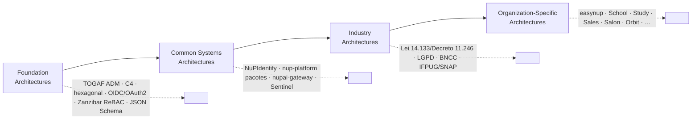
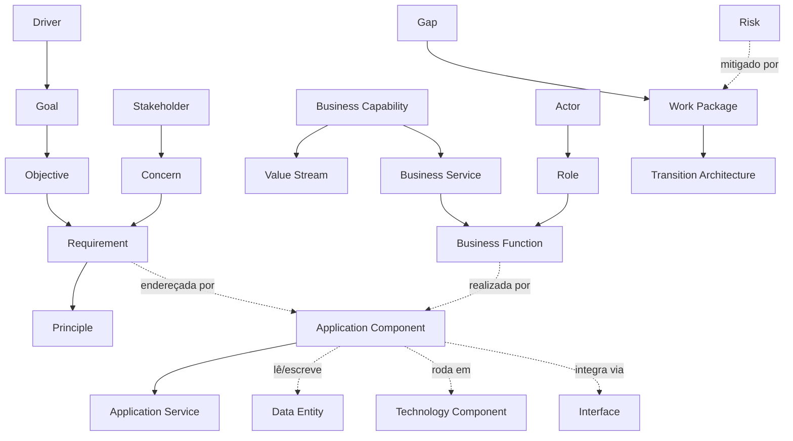

# Architecture Repository, Enterprise Continuum & Metamodelo

> **TOGAF — Preliminary Phase (estrutura do repositório).** Define como esta EA é organizada como um *Architecture Repository* formal, posiciona os ativos no *Enterprise Continuum*, e mapeia o metamodelo de conteúdo (que tipos de artefato existem e como se relacionam). É o "mapa do mapa".

---

## 1. Estrutura do Architecture Repository

O TOGAF organiza ativos de arquitetura em partições. Esta é a realização concreta na NuPTechs:

```
docs/enterprise-architecture/                 ← Architecture Repository (raiz)
├── README.md                                 ← índice + maturidade da própria EA
├── EVIDENCE-REGISTER.md                       ← governança: prova de leitura + correções
│
├── 00-preliminary.md  00b-…-metamodel.md      ← Architecture Capability (princípios, governança, metamodelo)
├── 01-architecture-vision.md                  ← Phase A
├── 02-business-architecture.md                ← Phase B
├── 03-data-architecture.md                    ← Phase C (Data)
├── 04-application-architecture.md             ← Phase C (Application)
├── 05-technology-architecture.md              ← Phase D
├── 06-opportunities-migration.md              ← Phase E/F
├── 07-governance.md                           ← Phase G/H
├── 08-visualization-state-of-art.md           ← anexo (decisão de tooling)
├── 09-architecture-requirements-specification.md  ← Requirements Management (núcleo)
│
├── catalogs/        ← listas de blocos de construção (Architecture Building Blocks)
├── matrices/        ← relações entre blocos
├── diagrams/        ← visões renderizadas
├── cross-cutting/   ← Security, Privacy/LGPD, Risk (atravessam todas as fases)
├── phases/          ← Transition Architectures, Capability Assessment
│
├── viewer/          ← Solutions Continuum: dashboard navegável (Cytoscape)
└── likec4/          ← Solutions Continuum: modelo as-code navegável + MCP + PNGs
```

### Mapeamento às partições TOGAF

| Partição TOGAF | Conteúdo NuPTechs |
|---|---|
| **Architecture Metamodel** | este documento (§3) |
| **Architecture Capability** | `00-preliminary` (princípios PA-01..08, governança) |
| **Architecture Landscape** | Fases A–D + catálogos/matrizes/diagramas (baseline + target) |
| **Reference Library** | `08-visualization`, ADRs dos repos, padrões hexagonais reusados |
| **Standards Information Base (SIB)** | `catalogs/technology-standards.md` + `catalogs/principles-catalog.md` |
| **Governance Log** | `EVIDENCE-REGISTER.md` + `07-governance.md` + ADRs corporativos |

---

## 2. Enterprise Continuum — posicionamento dos ativos

O Enterprise Continuum vai do **genérico (Foundation)** ao **específico (Organization-Specific)**. Posiciona-se cada ativo da NuPTechs:



| Camada | Ativos NuPTechs | Natureza |
|---|---|---|
| **Foundation** | TOGAF, C4, padrão hexagonal (ports & adapters), OIDC/OAuth2, Zanzibar (ReBAC), JSON Schema 2020-12, FEEL/DMN | Padrões de indústria adotados |
| **Common Systems** | **Os 4 pilares** — NuPIdentify, nup-platform, nupai-gateway, Sentinel | Capacidades reusáveis transversais (Solutions Continuum: viewer + likec4) |
| **Industry** | Modelagem Lei 14.133/Decreto 11.246/IN SGD 94 (gov), LGPD, BNCC (educação), IFPUG/SNAP (métricas de software) | Específico de setor/domínio |
| **Organization-Specific** | easynup, School, Study, Sales, Salon, Orbit, AIM, Chunks, Services, kan + libs xlsx + site | Produtos finais |

> Insight de continuum: a NuPTechs tem **Common Systems Architecture própria e forte** (os 4 pilares) — isso é o que diferencia "plataforma" de "coleção de apps". A dívida (Fase E/F) é a *adoção* dos Common Systems pelas Organization-Specific architectures.

---

## 3. Metamodelo de Conteúdo (entidades de arquitetura e relações)

O metamodelo define os *tipos* de bloco que esta EA cataloga e como se ligam — é o esquema sob os catálogos/matrizes.



### Catálogo de tipos de bloco (Building Blocks)

| Tipo (metamodelo) | Onde catalogado | Exemplos NuPTechs |
|---|---|---|
| **Principle** | `catalogs/principles-catalog.md` | PA-01 Identidade centralizada |
| **Driver / Goal / Objective** | `catalogs/driver-goal-objective.md` | Consolidação técnica; Pitch investidor |
| **Stakeholder / Concern** | `matrices/stakeholder-map.md` | Founder, Investidor, Cliente gov, DPO |
| **Business Capability** | `02-business` (capability map) | Gestão de Identidade; IA; Auditoria |
| **Value Stream** | `02-business` | Contrato público ponta-a-ponta |
| **Actor / Role** | `catalogs/organization-actor-role.md` | Gestor de contrato; Fornecedor |
| **Application Component** | `catalogs/application-portfolio.md` | easynup, NuPIdentify, nupai-gateway |
| **Application Service** | `04-application` | `/easynup/exerciseDataSubjectRight.v1` |
| **Interface** | `catalogs/integration-matrix.md` | OIDC, Finding v2, webhook HMAC |
| **Data Entity** | `catalogs/data-entity-catalog.md` | Contract, ServiceOrder, ManagerObservation |
| **Technology Component** | `catalogs/technology-standards.md` | PostgreSQL 16, Spring Boot 3.5.11, Railway |
| **Requirement** | `09-architecture-requirements-specification.md` | REQ-SEC-01 RLS ativa |
| **Gap / Work Package** | `matrices/consolidated-gaps-solutions-dependencies.md` | G1 IA fragmentada → WP-IA |
| **Transition Architecture** | `phases/transition-architectures.md` | T1, T2, T3 |
| **Risk** | `cross-cutting/risk-register.md` | R1 segredo Orbit |

---

## 4. Architecture Building Blocks (ABB) vs Solution Building Blocks (SBB)

| Capacidade | ABB (o que precisa existir) | SBB (a solução concreta NuPTechs) |
|---|---|---|
| Identidade | Provedor OIDC + autorização tri-modelo | **NuPIdentify** |
| IA governada | Gateway LLM provider-agnostic + RAG + guardrails | **nupai-gateway** |
| Pagamentos | Orquestração multi-PSP + outbox + idempotência | **@nuptechs/payments-core + billing** |
| Auditoria | Cadeia tamper-proof fail-closed | **@nuptechs/audit-chain + AuditHashChainComponent** |
| Qualidade de código | Detecção + correção assistida + governança | **Suite Sentinel** |
| Multi-tenant | Isolamento por tenant fail-closed | **TenantGuardComponent (app) + RLS (dormente) + namespaces Pinecone** |

> Onde o SBB ainda não realiza o ABB plenamente (ex: RLS dormente, gateway sem deploy, self-healing sem loop fechado), há um **gap** rastreado na Fase E/F e no Risk Register.

---

## 5. Conformidade do conteúdo com o ADM

Esta EA cobre o ciclo ADM completo + o núcleo de Requirements Management. A maturidade de cada artefato está no [README](README.md#maturidade-da-ea). Artefatos marcados *iteração 2* são lacunas conscientes (ver [EVIDENCE-REGISTER §5](EVIDENCE-REGISTER.md)) — coerente com a natureza iterativa do ADM, não omissão.
