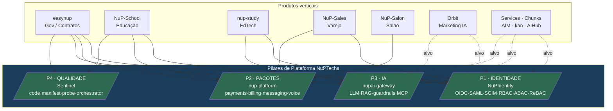
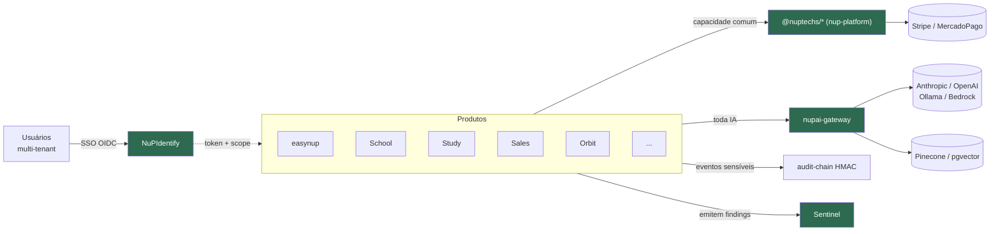

# Fase A — Architecture Vision

> **TOGAF ADM · Phase A.** A visão de alto nível da arquitetura-alvo, os stakeholders, e a proposta de valor. É o documento que alinha "para onde vamos" e que sustenta a **narrativa de plataforma para investidor**.

---

## 1. A visão em uma frase

> **A NuPTechs é uma plataforma de software corporativo com uma espinha dorsal comum — identidade, IA, pagamentos e auditoria — sobre a qual produtos verticais de mercados distintos (governo, educação, varejo, serviços) são construídos com reuso máximo e governança nativa.**

A mudança de mentalidade que a EA propõe: deixar de ver 24 repositórios como 24 produtos independentes e passar a vê-los como **4 pilares de plataforma + N produtos sobre eles**.

---

## 2. Os quatro pilares de plataforma (a tese central)

> Linhas sólidas = adoção real hoje. Linhas tracejadas (`-.->`) = adoção-alvo proposta (gaps de consolidação).

### P1 · Identidade — `NuPIdentify`
Provedor de identidade próprio, de nível world-class. Entrega SSO, autorização em três modelos (RBAC + ABAC + ReBAC Zanzibar-style), MFA/passkeys, provisionamento SCIM, federação SAML, e billing de licenças por sistema. **Já é a espinha dorsal de identidade** de easynup, School, Study, Sales, kan, AIM, Sentinel.

### P2 · Pacotes compartilhados — `nup-platform`
~30 pacotes `@nuptechs/*`: orquestração de pagamentos multi-PSP (Stripe/MercadoPago) com outbox+idempotência, billing/assinaturas, commerce, delivery/geo, messaging, conferência (mediasoup SFU + HLS), voice-agent, e o `shared-kernel` (Money, CPF, Email, idempotência). Distribuídos via GitHub Packages.

### P3 · IA — `nupai-gateway`
Gateway de LLM provider-agnostic com 14 portas hexagonais (llm-provider, vector-store, reranker, semantic-cache, guardrail, observability…). Fala vocabulário de domínio (`ModelPolicy.quality`), executa "recipes" versionadas de RAG, e expõe superfície MCP. **É o pilar de IA pretendido — hoje subutilizado.**

### P4 · Qualidade — `Sentinel`
Plataforma própria de inteligência de código: orquestrador (correlaciona findings de 5 fontes, dedup por símbolo, abre PR de correção) + manifest (análise estática auth/schema, gera OPA Rego/Policy Matrix/compliance-report) + probe (captura runtime browser/network/DB) + codelens (AST/grafo/dead-code). On-prem, audit HMAC, loop diagnose→correct→verify.

---

## 3. Stakeholders e suas preocupações

| Stakeholder | Preocupação primária | Onde a EA responde |
|---|---|---|
| **Fundador / lead dev** | Reduzir custo de manter 24 repos; foco | Fase E/F (consolidação) |
| **Investidor** | É plataforma defensável ou 24 side-projects? | Esta fase + Fase B (capacidades) |
| **Cliente setor público (easynup)** | Compliance Lei 14.133, auditoria, on-prem, LGPD | Fase D (tecnologia) + PA-04/05/06 |
| **Cliente B2B (School/Sales/Salon)** | Confiabilidade, SSO, pagamentos | Pilares P1/P2 |
| **Desenvolvedor / sessão IA** | Reuso, padrões claros, não duplicar | Fase D + catálogo de padrões |
| **Auditor / DPO** | Rastreabilidade tamper-proof | PA-04, audit HMAC chain |

---

## 4. Proposta de valor — versão investidor

A história de plataforma se sustenta em três camadas de defensabilidade:

### 4.1 Fosso de domínio (o easynup)
O produto-bandeira não é um CRUD: são **~608k LOC, 210 entidades JPA, 266 migrations, 42 ADRs**, modelando o ciclo de vida de contratos públicos brasileiros (Lei 14.133/2021, Decreto 11.246/2022) com:
- **Auditoria HMAC tamper-proof cross-process** (Java↔Node) — raríssimo no mercado.
- **IA jurídica com RAG multi-tenant isolado** (namespaces Pinecone `legal-public` / `legal-internal-<org>` / `guidelines-<org>` que nunca se cruzam).
- **Schema-as-Code + motor FEEL/DMN** — configurabilidade sem código, versionada com aprovação.
- **Glosa como ato administrativo fundamentado** (não automática) — entende a regra de negócio do setor público, não só a mecânica.

Esse nível de profundidade leva anos para um concorrente replicar. É o ativo número 1.

### 4.2 Fosso de plataforma (os 4 pilares)
NuPTechs não precisa comprar Auth0 + Permit.io + um gateway de IA + uma plataforma de qualidade: **construiu os quatro**, e eles compõem. Um IdP que combina RBAC+ABAC+ReBAC supera Auth0+Permit.io combinados em features. Isso reduz custo per-seat (decisivo em licitação pública) e elimina lock-in de terceiros.

### 4.3 Fosso de portfólio (a amplitude)
Com a mesma espinha dorsal, a NuPTechs ataca mercados verticais distintos:

| Vertical | Produto | Mercado |
|---|---|---|
| Governo / contratos TI | **easynup** | Setor público BR (Lei 14.133) |
| Educação básica | **NuP-School** | Escolas (gestão, BNCC, famílias) |
| EdTech / concursos | **nup-study** | Estudantes, aprendizagem adaptativa IA |
| Varejo / PDV | **NuP-Sales** | Comércio (web + mobile) |
| Serviços de salão | **NuP-Salon** | Barbearias/salões (app cliente) |
| Marketing | **Orbit** | PMEs (geração de conteúdo IA) |
| Dev-tools | **Sentinel** | Qualidade/segurança de código (produto futuro) |
| Componentes | **nup-xlsx-*** | Libs de planilha (alternativa a Handsontable/SpreadJS) |

Cada vertical valida que a plataforma é reutilizável — e cada um é um vetor de receita.

---

## 5. Visão da arquitetura-alvo (high-level)

No alvo: **um único ponto de identidade, um único ponto de IA, um único conjunto de pacotes, uma única cadeia de auditoria.** Os produtos viram clientes finos da plataforma.

---

## 6. Riscos e restrições da visão

| Risco | Mitigação |
|---|---|
| Consolidar tudo de uma vez paralisa entrega de feature | Roadmap em ondas incrementais (Fase E/F); cada onda entrega valor isolado |
| `nupai-gateway` ainda é early (não provado em produção) | Onda 2 valida com 1 produto piloto (study ou easynup) antes de migrar todos |
| Migrar satélites estagnados pode não valer o esforço | Fase E/F classifica: consolidar vs arquivar vs reposicionar |
| Founder-bus-factor (um mantenedor) | EA + ADRs reduzem conhecimento tácito; é parte do valor do documento |

---

## 7. Critérios de sucesso da arquitetura

1. **100% dos produtos com usuário** autenticam via NuPIdentify (hoje: ~70%).
2. **0 stacks de IA paralelos** — toda IA via `nupai-gateway` (hoje: 5 paralelos).
3. **0 serviços de produção em Replit** (hoje: 5).
4. **1 cadeia de auditoria** unificada via `@nuptechs/audit-chain`.
5. **Catálogo de aplicações** mantido e classificado (consolidar/arquivar) — sem repositório "órfão" não-categorizado.

→ [Fase B — Business Architecture](02-business-architecture.md): as capacidades de negócio que esses pilares e produtos realizam.
