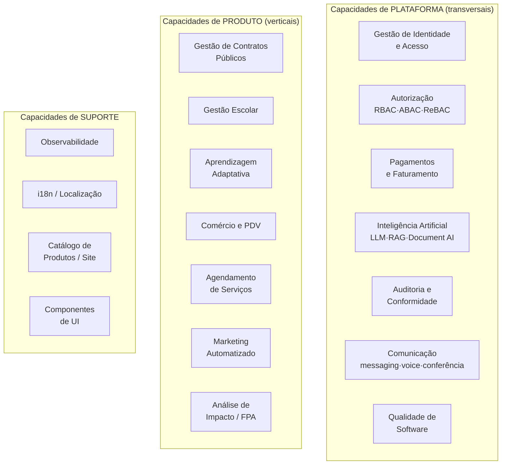
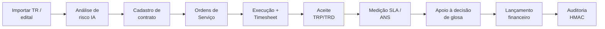
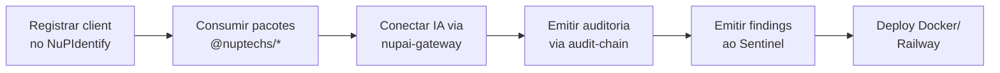
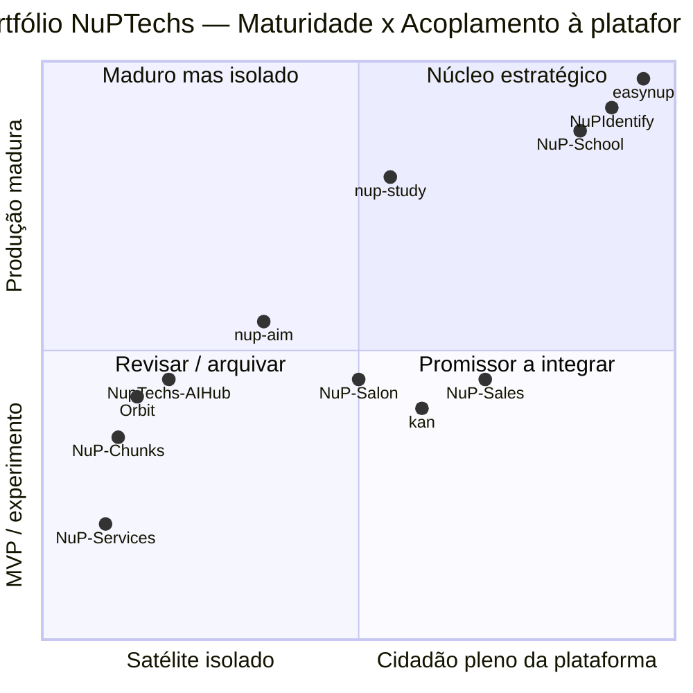

# Fase B — Business Architecture

> **TOGAF ADM · Phase B.** Modela *o que a NuPTechs faz* em termos de negócio: capacidades, value streams e o mapa de produtos por mercado — independentemente da tecnologia. É a ponte entre a visão (Fase A) e a realização técnica (Fases C/D).

---

## 1. Modelo de capacidades de negócio (Business Capability Map)

Capacidades são *o que* a organização sabe fazer, agrupadas em três camadas: **capacidades de plataforma** (transversais), **capacidades de produto** (por vertical) e **capacidades de suporte**.

### 1.1 Capacidades de plataforma — realização atual

| Capacidade | Realizada por | Maturidade |
|---|---|---|
| **C1 · Identidade** | NuPIdentify (OIDC/SAML/SCIM/MFA/passkeys) | 🟢 Produção |
| **C2 · Autorização** | NuPIdentify (RBAC + ABAC policies + ReBAC Zanzibar) | 🟢 Produção |
| **C3 · Pagamentos/Faturamento** | nup-platform (`payments-core`, `billing`, `outbox-worker`, multi-PSP) | 🟢 Produção |
| **C4 · IA** | nupai-gateway (alvo) + 5 stacks paralelos (atual) | 🟡 Fragmentada |
| **C5 · Auditoria** | `@nuptechs/audit-chain` + `AuditHashChainComponent` (easynup) + Sentinel | 🟢 Produção (easynup) / 🟡 não-uniforme |
| **C6 · Comunicação** | nup-platform (`messaging-*`, `voice-agent-*`, `conference-*`) | 🟢 Núcleo / 🟡 voice/conf iniciais |
| **C7 · Qualidade de Software** | Suite Sentinel (orchestrator/manifest/probe/codelens) | 🟢 Interno / 🟡 loop self-healing parcial |

### 1.2 Capacidades de produto — realização atual

| Capacidade | Produto | Maturidade |
|---|---|---|
| **D1 · Contratos públicos** | easynup | 🟢 Produção (flagship) |
| **D2 · Gestão escolar** | NuP-School | 🟢 Produção |
| **D3 · Aprendizagem adaptativa** | nup-study | 🟢 Maduro |
| **D4 · Comércio/PDV** | NuP-Sales | 🟡 MVP (bem arquitetado) |
| **D5 · Agendamento de serviços** | NuP-Salon-Client, NuP-Services | 🟡 MVP / 🔴 estagnado |
| **D6 · Marketing automatizado** | Orbit | 🟡 MVP/experimento |
| **D7 · Análise de impacto/FPA** | nup-aim, NupTechs-AIHub, easynup (PfAnalysis) | 🟡 Triplicada |

---

## 2. Value Streams (fluxos de valor)

Os value streams mostram como a organização entrega valor ao cliente final, ponta a ponta. Dois são detalhados — o de maior valor (contratos públicos) e o padrão de plataforma.

### 2.1 Value stream do flagship — "Gestão de contrato público de ponta a ponta"

Cada etapa é uma área funcional documentada no `easynup/docs/manual/areas-funcionais/`. Este é o value stream mais profundo e defensável do parque.

### 2.2 Value stream de plataforma — "Onboarding de um novo produto"

No alvo, lançar um novo produto vertical deveria seguir um caminho padronizado:

Hoje esse caminho é parcial e inconsistente entre produtos. Padronizá-lo é o objetivo de consolidação (Fase E/F) — e o que transforma "fazer um app" em "instanciar um produto sobre a plataforma".

---

## 3. Mapa de produtos por mercado (portfólio de negócio)

**Leitura estratégica:**
- **Quadrante 1 (núcleo):** easynup, NuPIdentify, NuP-School — onde está o valor; proteger e investir.
- **Quadrante 2 (maduro isolado):** nup-study — produto forte que deveria adotar mais pilares (IA via gateway).
- **Quadrante 4 (promissor a integrar):** NuP-Sales, Salon, kan, nup-aim — bem feitos, falta puxar para a plataforma.
- **Quadrante 3 (revisar):** NuP-Services, NuP-Chunks, Orbit, AIHub — decidir consolidar, reposicionar ou arquivar (ver Fase E/F).

---

## 4. Atores e papéis de negócio

| Ator | Produto onde aparece | Papel |
|---|---|---|
| Gestor de contrato / fiscal | easynup | Gerencia contrato, decide glosa, dá aceite |
| Servidor público / órgão | easynup | Tenant (ContractingEntity) |
| Fornecedor (Vendor) | easynup | Contraparte do contrato |
| Diretor / coordenador escolar | NuP-School | Gestão acadêmica |
| Responsável / família | NuP-School | Comunicação, autorizações |
| Estudante / concurseiro | nup-study | Aprendizagem |
| Proprietário / funcionário / cliente | NuP-Sales | Varejo (3 perfis) |
| PME sem conhecimento de marketing | Orbit | Geração de conteúdo |
| Desenvolvedor / time | Sentinel, kan | Qualidade e gestão de tarefas |

---

## 5. Regras de negócio transversais (governadas por princípio)

- **Multi-tenancy** é regra de negócio, não detalhe técnico: todo dado pertence a uma organização (PA-06).
- **Auditoria fail-closed** é requisito de negócio no setor público: nenhum evento sensível sem trilha (PA-04).
- **Glosa não é automática** (easynup, ADR-049): é ato administrativo fundamentado — a plataforma *apoia* a decisão, não a toma. Reflete entendimento profundo da regra do setor público.
- **IA é assistiva e auditável**, nunca caixa-preta: citações verificadas contra a fonte (padrão presente em easynup, codelens, nup-aim).

→ [Fase C — Data Architecture](03-data-architecture.md): como esses conceitos de negócio viram dados.
