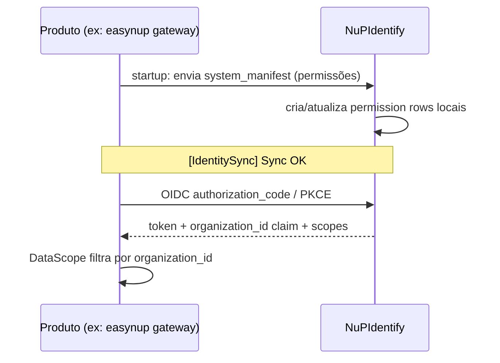
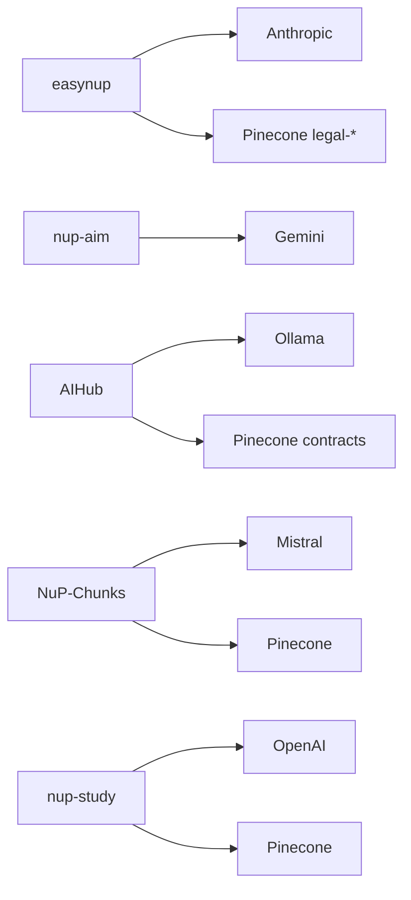
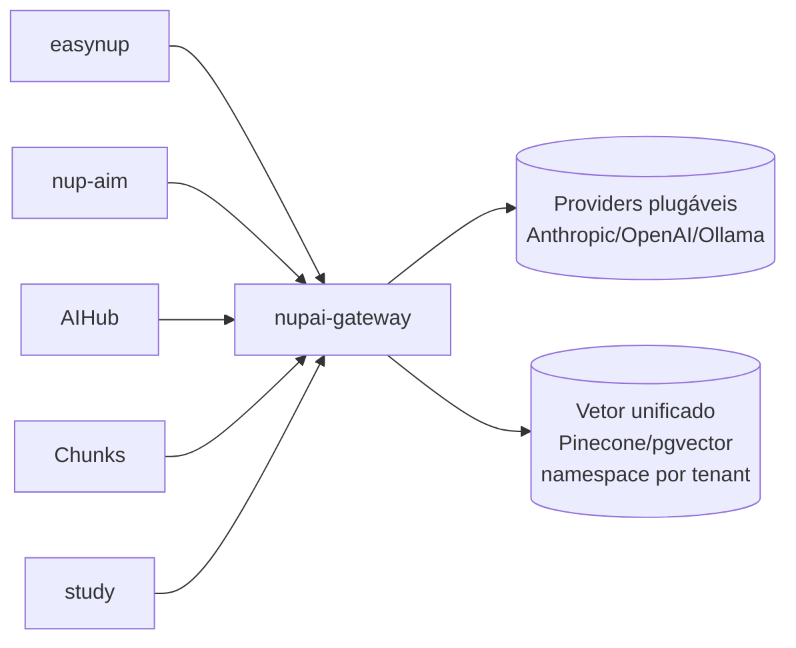
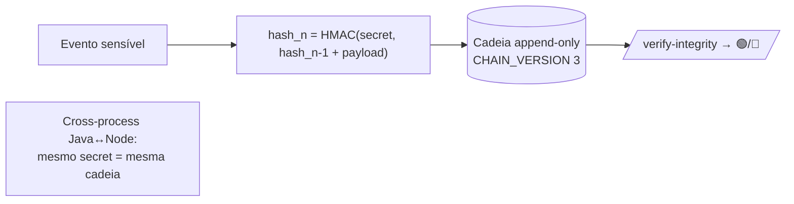

# Fase C — Data Architecture

> **TOGAF ADM · Phase C (Data).** Modela os dados do parque: entidades-chave, modelo de multi-tenant, persistência, fluxos de dado e a fragmentação atual de bancos. Foco em onde a falta de governança de dado cria risco (LGPD, auditoria, vazamento cross-tenant).

---

## 1. Domínios de dado (Data Domains)

Os dados do parque se organizam em domínios. Cada domínio tem um **sistema-dono** (system of record):

| Domínio de dado | Sistema-dono | Tecnologia de persistência |
|---|---|---|
| **Identidade & Acesso** | NuPIdentify | PostgreSQL (Drizzle) + Redis |
| **Contratos públicos** | easynup | PostgreSQL 16 (JPA/Hibernate/Liquibase) + Redis |
| **Pagamentos & Billing** | nup-platform (lib) → DB do consumidor | PostgreSQL (Outbox) + Redis Streams |
| **Educação (escolar)** | NuP-School | PostgreSQL (Drizzle) — cluster compartilhado com Salon |
| **Aprendizagem** | nup-study | PostgreSQL (Drizzle) |
| **Comércio** | NuP-Sales | PostgreSQL 16 + Redis |
| **Conhecimento / RAG** | Pinecone (vetorial) — multi-consumidor | Pinecone + pgvector |
| **Auditoria** | Cadeia HMAC (easynup + Sentinel) | PostgreSQL (append-only) |
| **Marketing** | Orbit | PostgreSQL + Redis/Bull |
| **Qualidade de código (findings)** | Sentinel | PostgreSQL |

---

## 2. Entidades centrais por sistema (catálogo de dado resumido)

### 2.1 NuPIdentify — o modelo de identidade
Schema Drizzle particionado por domínio em `shared/schema/`:
- **Identidade:** `users`, `service_accounts`, `mfa_secrets`, `passkey_credentials`, `session`
- **Organização:** `teams`, `organization`, `organization_systems`, `organization_system_licenses`
- **Autorização:** RBAC (`rbac.ts`), ABAC (`abac_policy_evaluations`), ReBAC (`rebac.ts` — relações Zanzibar)
- **Protocolos:** `oauth_clients`, `authorization_codes`, `device_codes`, `saml_providers`, `scim_configurations`
- **Billing:** `tenant_subscriptions`, `licensing.ts`, `billing.ts`
- **Manifestos:** `system_manifests` — cada produto registra suas permissões aqui

> **Insight de arquitetura:** `system_manifests` + `organization_systems` é o que torna o IdP a *fonte única de verdade de permissões* do parque. Cada produto (easynup, School, kan…) envia seu manifesto de permissões no startup e o IdP cria as linhas locais. É o mecanismo que sustenta o princípio PA-01.

### 2.2 easynup — o modelo de contratos (210 entidades JPA)
Agregados principais em `src/main/java/easynup/persistence/entities/`:
- **Contract** (+ `ContractBalanceSnapshot/Movement/Reservation`, `ContractVendor`, `ContractProject`, `ContractRiskPlaybook`, `ContractLegalReference`)
- **ServiceOrder** (+ `ServiceOrderProfessional`)
- **Acceptance** (+ `AcceptanceStageConfig/Execution`, `AcceptanceEvidence`)
- **Sla / SlaIndicator / SlaMeasurement**
- **PfAnalysis / SnapPoint** (análises de tamanho)
- **ManagerObservation** (Diretriz do Gestor) · **DecisionAdvice** (apoio à decisão, ADR-049)
- **ContractingEntity / Vendor** (eixos de multi-tenant)
- **ConfigDefinition / ConfigVersion / ConfigDraft** (Schema-as-Code)

266 migrations Liquibase numeradas — a evolução de schema mais governada do parque.

### 2.3 Produtos verticais (Drizzle/Postgres)
- **NuP-School:** ~54 tabelas core + schemas por módulo (~118 `pgTable`) — BNCC, avaliações, gamificação, ouvidoria, carteirinhas.
- **nup-study:** 276 exports de schema (4.448 linhas), prefixo `nup_study` — materiais, mindmaps, flashcards+SRS, editais, knowledgeBase/chunks.
- **NuP-Sales:** domínio hexagonal rico (product/order/cart/loyalty/referral) + value-objects (`money.vo`, `cpf.vo`).
- **kan:** 21 tabelas (boards/tasks/columns/teams + custom fields + task events/audit).

---

## 3. Modelo de multi-tenancy

Multi-tenancy é regra de negócio (PA-06). O parque usa **abordagens diferentes**, e isso é uma fonte de dívida:

| Padrão | Onde | Avaliação |
|---|---|---|
| **`organization_id` direto na entidade** | easynup (Contract) | 🟢 Padrão-alvo |
| **Multi-tenant transitivo via FK** | easynup (11 entidades via `contract_id`) | 🟡 Funciona no app layer; RLS exige denormalização |
| **ReBAC + DataScope** | NuPIdentify, easynup, School | 🟢 Robusto |
| **Tenant por `organization_id` no JWT** | apps que consomem o IdP | 🟢 Padrão-alvo |
| **Sem multi-tenant explícito** | NuP-Services, Orbit (single-tenant ou API-key) | 🔴 Não escala multi-cliente com governança |

> **Achado documentado (easynup):** das 12 entidades com `customFieldsJson`, só `contract` tem `organization_id` direto; as outras 11 são multi-tenant por FK transitiva. RLS Postgres só funciona nelas com `EXISTS` via FK (caro) ou denormalização de `org_id` (planejado). Padronizar o eixo de tenant é trabalho de governança de dado.

---

## 4. Fluxos de dado críticos

### 4.1 Fluxo de identidade (todos os produtos → IdP)

### 4.2 Fluxo de IA + RAG (atual vs alvo)

**Atual (fragmentado):** cada app fala direto com seu provider e seu vetor.

**Alvo (governado):** tudo via gateway, RAG como recipe, tenant isolado por namespace.

### 4.3 Fluxo de auditoria (cadeia HMAC)

> Diferencial: a cadeia é compatível byte-a-byte entre o backend Java (easynup) e os componentes Node (`@nuptechs/audit-chain`). O segredo `AUDIT_HASH_SECRET` precisa ser idêntico cross-process — é configuração operacional crítica.

---

## 5. Conhecimento / dado vetorial (RAG)

| Consumidor | Vetor | Namespaces / isolamento |
|---|---|---|
| easynup | Pinecone + pgvector | `legal-public`, `legal-internal-<orgId>`, `guidelines-<orgId>` (nunca cruzam) |
| NupTechs-AIHub | Pinecone serverless | índice `nuptechs-contracts-v2` (nomic-embed 768d) |
| NuP-Chunks | Pinecone | isolamento por ContentSpace/Context |
| nup-study | Pinecone | knowledgeBase/knowledgeChunks |
| nupai-gateway | Pinecone + pgvector (port) | multi-tenant por projeto/API key |

**Tese de consolidação de dado vetorial:** cinco consumidores de Pinecone sem governança central de namespace/custo. O `nupai-gateway` já abstrai `vector-store` como porta — centralizar o RAG nele unifica isolamento multi-tenant, custo e observabilidade (gap G1 + G4).

---

## 6. Fragmentação de persistência (dívida de dado)

| Tecnologia | Repositórios | Risco |
|---|---|---|
| PostgreSQL gerenciado (Railway) | easynup, NuPIdentify, School, Sales | 🟢 OK |
| **Neon serverless** | NuP-Services, kan | 🟡 Provider distinto, sem padrão |
| **Cluster Postgres compartilhado** (5433) | NuP-School + NuP-Salon | 🟡 Acoplamento de banco entre produtos |
| Postgres em Replit | nup-study, Chunks, AIHub, xlsx-demos | 🔴 Não é infra de produção |
| ORM Drizzle | Maioria dos apps Node | 🟢 Padrão de fato |
| JPA/Hibernate/Liquibase | easynup (Java) | 🟢 Apropriado ao stack Java |

**Recomendações de governança de dado:**
1. Definir **padrão de tenant key** (`organization_id` direto) e migrar entidades transitivas.
2. Centralizar **RAG/vetor** no gateway (isolamento por namespace governado).
3. Sair de **Neon e Replit Postgres** para Postgres gerenciado padrão (Railway/cloud).
4. Desacoplar o **banco compartilhado School↔Salon** (cada produto, seu cluster).
5. Catalogar dado **pessoal (LGPD)** por entidade — pré-requisito para o direito do titular já modelado no easynup (ADR-051 `exerciseDataSubjectRight.v1`).

→ [Fase C — Application Architecture](04-application-architecture.md): como as aplicações que produzem e consomem esses dados se organizam.
