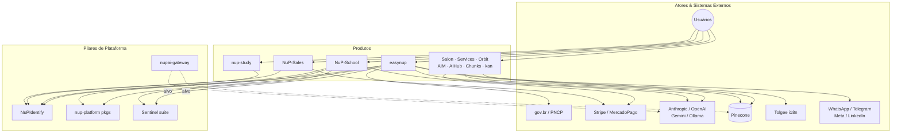
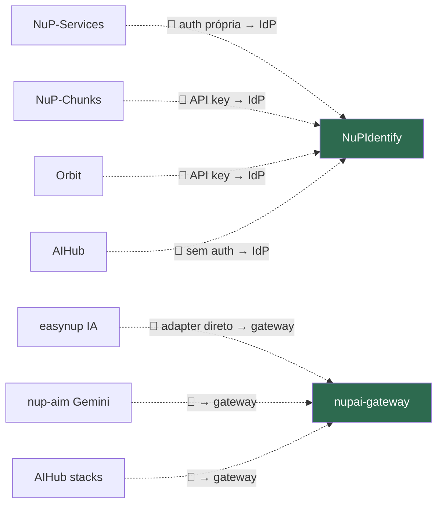

# Fase C — Application Architecture

> **TOGAF ADM · Phase C (Application).** Cataloga as aplicações do parque, suas responsabilidades, e — o mais importante — o **mapa de integrações reais** (quem chama quem). Expõe a fragmentação de adoção dos pilares de plataforma.

---

## 1. Taxonomia de aplicações

Os 24 repositórios se classificam em 5 tipos arquiteturais:

| Tipo | Repositórios |
|---|---|
| **Pilar de plataforma** | NuPIdentify, nup-platform, nupai-gateway, nup-sentinel(+probe+manifest), codelens |
| **Produto vertical (deployável)** | easynup, NuP-School, nup-study, NuP-Sales, NuP-Salon-Client, NuP-Services, Orbit, nup-aim, NupTechs-AIHub, NuP-Chunks, kan |
| **Biblioteca publicada** | nup-xlsx-core, nup-xlsx-preview, nup-xlsx-tokens (GitHub Packages) |
| **Site / institucional** | nuptechs (portal Next.js) |
| **Utilitário / experimento** | nup-xlsx-editor (demo), nuptechs-nfc (Android HCE) |

Fichas detalhadas: [catalogs/application-portfolio.md](catalogs/application-portfolio.md).

---

## 2. Diagrama de contexto (C4 nível 1 — sistema)



---

## 3. Matriz de adoção dos pilares (o coração da consolidação)

Esta matriz é o diagnóstico central. ✅ = adota · ⬜ = não adota · 🎯 = alvo de adoção.

| Produto | P1 Identidade<br/>(NuPIdentify) | P2 Pacotes<br/>(nup-platform) | P3 IA<br/>(nupai-gateway) | P4 Qualidade<br/>(Sentinel) | Audit<br/>HMAC |
|---|:---:|:---:|:---:|:---:|:---:|
| **easynup** | ✅ | ⬜ 🎯 | ⬜ 🎯 | ✅ | ✅ |
| **NuP-School** | ✅ | ✅ (13 pkgs) | ⬜ | ✅ | ⬜ 🎯 |
| **nup-study** | ✅ (auth) | ⬜ 🎯 | ⬜ 🎯 | ⬜ | ⬜ 🎯 |
| **NuP-Sales** | ✅ (PKCE) | ✅ (payments) | n/a | ⬜ | ⬜ |
| **NuP-Salon-Client** | ⬜ | ✅ (commerce) | n/a | ⬜ | ⬜ |
| **kan** | ✅ | ⬜ | n/a | ⬜ | ⬜ |
| **nup-aim** | ✅ (opt-in) | ⬜ | ⬜ 🎯 | ⬜ | ⬜ |
| **NupTechs-AIHub** | ⬜ 🎯 | ⬜ | ⬜ 🎯 | ⬜ | ⬜ |
| **NuP-Chunks** | ⬜ 🎯 | ⬜ | ⬜ 🎯 | ⬜ | ⬜ |
| **Orbit** | ⬜ 🎯 | ⬜ | ⬜ 🎯 | ⬜ | ⬜ |
| **NuP-Services** | ⬜ 🎯 | ⬜ | n/a | ⬜ | ⬜ |
| **nup-sentinel** | ✅ (PKCE) | ⬜ | via porta hex | (é o pilar) | ✅ |
| **manifest** | ✅ (confidential) | ⬜ | ⬜ | (é o pilar) | ✅ |

**Diagnóstico:**
- **P1 (Identidade):** boa adoção (~70%) — mas 4 produtos fora (Salon, AIHub, Chunks, Orbit, Services). Maior ganho rápido.
- **P2 (Pacotes):** adoção concentrada (School, Sales, Salon). Oportunidade em easynup e study.
- **P3 (IA):** **adoção zero** — o gateway existe e ninguém usa. Maior dívida estrutural.
- **P4 (Qualidade):** Sentinel emite findings para o parque via codelens-emit, mas a integração explícita é só easynup/School.

---

## 4. Mapa de integrações reais (evidência)

### 4.1 Integrações confirmadas no código

```mermaid
graph LR
    EZ[easynup] -->|OIDC systemId=easynup| ID[NuPIdentify]
    EZ -->|completion.port → adapter| ANT[Anthropic]
    EZ -->|vector-store.port| PINE[Pinecone/pgvector]
    EZ -->|MessageSource + webhook HMAC| TOLG[Tolgee]
    EZ -->|@nuptechs/nup-xlsx-preview/vue| XLSX[nup-xlsx-preview]
    EZ -.->|MCP / ADR-044| SENT[nup-sentinel]

    SCH[NuP-School] -->|OIDC + ReBAC sync| ID
    SCH -->|13 pacotes @nuptechs/*| PKG[nup-platform]
    SCH -->|payments| STRIPE[Stripe]

    SAL[NuP-Sales] -->|OIDC PKCE web+mobile| ID
    SAL -->|payments-core bridge| PKG

    SALON[Salon-Client] -->|commerce + shared-kernel| PKG

    KAN[kan] -->|permissions.json sync 5min| ID
    AIM[nup-aim] -->|OIDC opt-in + SDK| ID

    MAN[manifest] -->|Finding v2 source=auto_manifest| SENT
    PRB[probe] -->|webhook HMAC session.*| SENT
    CL[codelens] -->|emit dead_code| SENT
    SENT -->|AIPort claude.adapter| ANT
    SENT -->|EmbeddingPort| OPENAI[OpenAI embeddings]
    SENT -->|OIDC PKCE public| ID
```

### 4.2 Integrações ausentes que deveriam existir (gaps)



---

## 5. Padrões arquiteturais de aplicação (o que se repete bem)

A boa notícia: o parque já converge em padrões maduros — só não os compartilha por código.

| Padrão | Onde aparece | Avaliação |
|---|---|---|
| **Ports & Adapters (hexagonal)** | easynup (6 ports), nupai-gateway (14 ports), Sentinel (17 ports), NuP-Sales, Orbit | 🟢 Cultura arquitetural forte |
| **Repository pattern** | easynup gateway, NuPIdentify | 🟢 |
| **Outbox + idempotência** | nup-platform payments | 🟢 |
| **Anti-alucinação por citação verificada** | easynup, codelens, nup-aim, AIHub | 🟡 Mesma filosofia, código não compartilhado |
| **Manifesto de permissões + sync** | easynup, kan, study, Sentinel | 🟢 Padrão de integração com IdP |
| **CQRS** | kan | 🟡 Isolado |
| **Schema-as-Code** | easynup (ADR-006+) | 🟢 Diferencial |

> **Insight:** a NuPTechs tem uma **cultura hexagonal consistente** em 5 sistemas independentes. Isso é raro e valioso — significa que extrair capacidades para pacotes compartilhados (P2/P3) é arquiteturalmente viável, porque os contratos já são portas.

---

## 6. Aplicações candidatas a racionalização

| Aplicação | Situação | Recomendação preliminar (detalhe na Fase E/F) |
|---|---|---|
| **NupTechs-AIHub** | Capacidade de IA documental que duplica gateway+Chunks+easynup; infra frágil (Ollama via túnel Cloudflare) | Absorver capacidades úteis no `nupai-gateway`; descontinuar como app |
| **NuP-Chunks** | RAG/chunking isolado, estagnado desde abril | Transformar em *recipe* do `nupai-gateway` ou arquivar |
| **NuP-Services** | Marketplace MVP, auth própria, Replit, parado | Reposicionar sobre a plataforma ou arquivar |
| **nup-aim** | FPA/análise de impacto — sobrepõe `PfAnalysis` do easynup | Avaliar fusão: FPA como módulo/serviço do easynup |
| **nup-xlsx-editor** | Demo sem lib extraída | Extrair lib `@nuptechs/nup-xlsx-editor` ou manter como demo |

→ [Fase D — Technology Architecture](05-technology-architecture.md): a camada de stack, infraestrutura e deploy sob essas aplicações.
