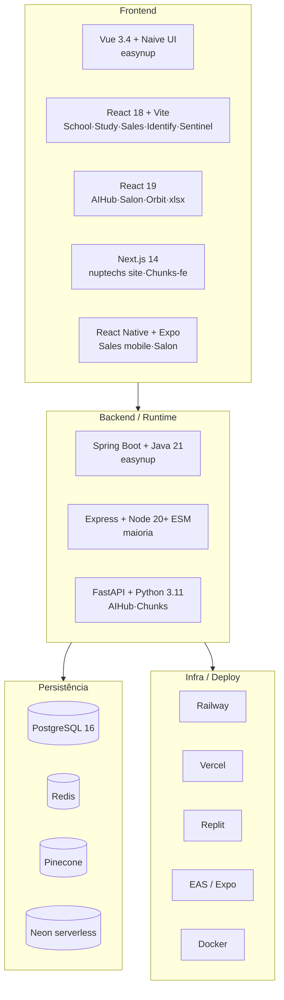
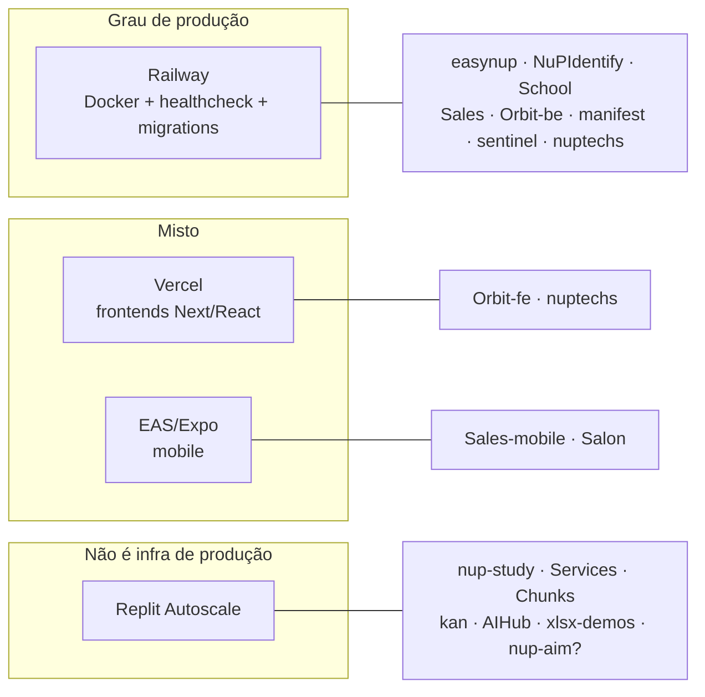

# Fase D — Technology Architecture

> **TOGAF ADM · Phase D.** A camada de tecnologia: linguagens, frameworks, runtime, persistência, infraestrutura, deploy e observabilidade. Identifica os **padrões de fato** e as **divergências** que custam reprodutibilidade e on-prem.

---

## 1. Stack por camada (visão consolidada)

---

## 2. Padrões de fato (technology standards)

| Camada | Padrão dominante | Adoção |
|---|---|---|
| **Linguagem backend** | TypeScript/Node (ESM) | ~18 repos · 🟢 padrão |
| **Linguagem backend (flagship)** | Java 21 + Spring Boot | easynup · 🟢 apropriado à escala |
| **Linguagem backend (IA/Python)** | Python 3.11 + FastAPI | AIHub, Chunks · 🟡 minoria |
| **ORM (Node)** | Drizzle ORM | ~12 repos · 🟢 padrão de fato |
| **ORM (Java)** | JPA/Hibernate + Liquibase | easynup · 🟢 |
| **Banco** | PostgreSQL 16 | universal · 🟢 |
| **Cache/sessão/fila** | Redis | easynup, Identify, Sales, Orbit, kan · 🟢 |
| **Frontend** | React + Vite | maioria · 🟢 (exceto easynup=Vue) |
| **UI lib** | Radix/shadcn + Tailwind | maioria · 🟢 (exceto easynup=Naive UI) |
| **Monorepo** | Turborepo + npm workspaces | nup-platform, gateway, Sales, probe · 🟢 |
| **Auth** | OIDC via NuPIdentify | ~70% · 🟡 não-universal |
| **LLM** | divergente (Anthropic/OpenAI/Gemini/Ollama/Mistral) | 🔴 sem padrão |
| **Observabilidade** | OpenTelemetry + Prometheus + Grafana | easynup, Identify · 🟡 não-universal |

---

## 3. Divergências relevantes (dívida técnica de stack)

| Divergência | Repositórios | Impacto |
|---|---|---|
| **Frontend Vue vs React** | easynup (Vue) vs todo o resto (React) | 🟡 Aceitável — easynup é grande demais para migrar; manter |
| **Express 4 vs 5** | study/Services/Chunks (4) vs School/Sales/manifest (5) | 🟢 Baixo — padronizar em 5 gradualmente |
| **Router React Router vs Wouter** | School (RR) vs Study/Services/Chunks (Wouter) | 🟢 Cosmético |
| **Backend Python coexistindo** | AIHub, Chunks | 🟡 Justificável se for serviço de IA; senão, consolidar no gateway |
| **5 providers de LLM diferentes** | ver §4 | 🔴 Alta — resolvido por P3 |
| **DB provider diferente (Neon)** | Services, kan | 🟡 Sair para Postgres gerenciado padrão |

---

## 4. Stack de IA — o mapa da fragmentação (gap G1 detalhado)

| Sistema | Provider primário | Fallback | Vetor | Via gateway? |
|---|---|---|---|---|
| **easynup** | Anthropic (porta hex) | — | Pinecone + pgvector | ⬜ adapter próprio |
| **nup-aim** | Google Gemini | Anthropic/OpenAI nas deps | — | ⬜ |
| **NupTechs-AIHub** | Ollama (local, túnel Cloudflare) | OpenAI → Anthropic | Pinecone | ⬜ |
| **NuP-Chunks** | Mistral (embeddings) | Claude + OpenAI | Pinecone | ⬜ |
| **nup-study** | OpenAI | Anthropic + Gemini | Pinecone | ⬜ |
| **Orbit** | Anthropic | — | — | ⬜ |
| **Sentinel** | Anthropic (porta hex `AIPort`) | — | OpenAI embeddings | parcial (já hexagonal) |
| **nupai-gateway** | **todos via porta** | configurável | Pinecone + pgvector | **é o gateway** |

> A NuPTechs já **paga e mantém** integração com Anthropic, OpenAI, Gemini, Ollama, Mistral e Pinecone — em 7 lugares diferentes, sem governança central de custo, rate-limit, guardrail ou observabilidade. O `nupai-gateway` foi desenhado exatamente para ser o ponto único, com `quality: fast|standard|high|reasoning` mapeado a providers concretos. **A tecnologia-alvo já existe; falta adoção.**

---

## 5. Infraestrutura e deploy (gap G3 detalhado)

| Plataforma | Repos | Avaliação |
|---|---|---|
| **Railway (Docker)** | easynup, NuPIdentify, School, Sales, Orbit-backend, manifest, sentinel, nuptechs | 🟢 Padrão-alvo — reprodutível, healthcheck, on-prem-capaz via Docker |
| **Vercel** | Orbit-frontend, nuptechs | 🟢 OK para frontends estáticos/SSR |
| **EAS / Expo** | Sales-mobile, Salon | 🟢 OK para mobile |
| **Replit Autoscale** | nup-study, Services, Chunks, kan, AIHub, xlsx-demos | 🔴 **Não é infra de produção** — sem reprodutibilidade, sem on-prem |

**Recomendação:** migrar os serviços de produção do Replit para o padrão **Dockerfile + Railway** (mesmo template do easynup/Identify: healthcheck + migrations no startup + `restartPolicyMaxRetries`). Replit fica só para protótipo.

### 5.1 Padrão de deploy-alvo (template)

Todo serviço deployável deve ter:
- `Dockerfile` multi-stage (Node 22-alpine / eclipse-temurin para Java)
- `railway.toml` ou `railway.json` com healthcheck (`/health` ou `/actuator/health`) e `restartPolicyMaxRetries`
- Migrations rodando no startup do container
- `.env.example` completo e atualizado
- HML automático em push para `main`; produção manual e explícita

Este é exatamente o padrão maduro do easynup (`railway.json` + `railway.backend.toml`) e do NuPIdentify (Dockerfile "portable: Railway, AWS ECS/Fargate, GCP Cloud Run, Azure, Fly.io").

---

## 6. Observabilidade

| Capacidade | Onde existe | Lacuna |
|---|---|---|
| **Tracing (OpenTelemetry)** | easynup (Tempo), NuPIdentify (OTel SDK) | Maioria dos satélites sem tracing |
| **Métricas (Prometheus)** | easynup, NuPIdentify, Sentinel (`prom-client`) | Não-universal |
| **Dashboards (Grafana)** | easynup | Centralizar |
| **Captura runtime (Probe)** | Sentinel-probe (browser/network/DB) | Subutilizado fora do dev-loop |
| **Logs estruturados (pino)** | NuPIdentify, vários Node | Padronizar formato |

**Recomendação:** adotar o stack OTel→Tempo/Prometheus/Grafana do easynup como **padrão de observabilidade do parque**, com o Sentinel-probe como camada de captura runtime opcional para debug profundo.

---

## 7. Segurança — postura técnica e achado crítico

### 7.1 Pontos fortes
- **Auditoria HMAC tamper-proof** cross-process (easynup + audit-chain + Sentinel).
- **IdP com MFA/passkeys/step-up** (NuPIdentify).
- **Manifest gera OPA Rego + Policy Matrix** (compliance setor público).
- **Isolamento multi-tenant de RAG** por namespace (easynup).
- **Webhooks com HMAC + anti-replay + IP allowlist** (easynup ADR-050, Sentinel).

### 7.2 ⚠️ Achado crítico (ação imediata, fora do ciclo EA)
**`Orbit/docker-compose.yml`** tem `ANTHROPIC_API_KEY` e `ENCRYPTION_KEY` **em texto plano, commitados** no repositório. Risco: chave de IA exposta + chave de criptografia comprometida.
**Ação:** (1) rotacionar ambas as chaves *agora*; (2) removê-las do `docker-compose.yml` (usar env/secret manager); (3) reescrever o histórico git que contém o segredo, ou ao menos invalidar as chaves expostas.

### 7.3 Padrão-alvo de segredos
- Nenhum segredo em arquivo versionado.
- Segredos via variável de ambiente da plataforma de deploy (Railway/Vercel) ou secret manager.
- `AUDIT_HASH_SECRET` idêntico cross-process — gerido como segredo de plataforma, nunca fallback de dev em produção.

→ [Fase E/F — Opportunities & Migration](06-opportunities-migration.md): o roadmap que fecha os gaps identificados nas fases B/C/D.
