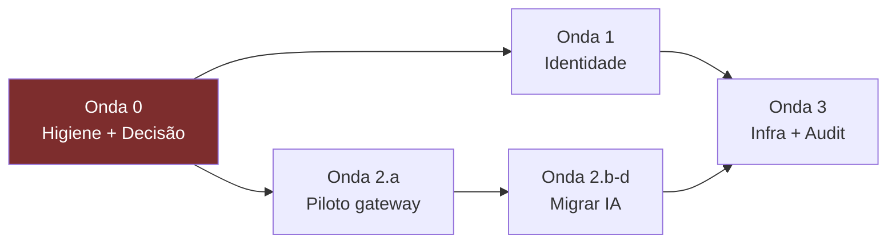

# Fases E & F — Opportunities, Solutions & Migration Planning

> **TOGAF ADM · Phases E (Opportunities & Solutions) e F (Migration Planning).** Aqui a EA vira ação: análise de gaps entre baseline e alvo, agrupamento em pacotes de trabalho, e o **roadmap de consolidação em ondas**. Este é o documento que o patrocinador usa para decidir prioridades.

---

## 1. Análise de Gaps (baseline → target)

| ID | Gap | Baseline (hoje) | Target (alvo) | Severidade | Esforço |
|---|---|---|---|---|---|
| **G0** | Segredo exposto no Orbit | Chaves em texto plano commitadas | 0 segredos versionados | 🔴 Crítico | Baixo (horas) |
| **G1** | IA fragmentada | 5+ stacks LLM/RAG paralelos | Tudo via `nupai-gateway` | 🔴 Alto | Alto |
| **G2** | Auth fora do IdP | 4-5 apps com auth própria | 100% via NuPIdentify | 🟠 Médio-Alto | Médio |
| **G3** | Deploy/infra disperso | Replit/Neon/etc misturados | Docker+Railway padrão | 🟠 Médio | Médio |
| **G4** | Governança de dado | Bancos e vetores dispersos | Padrão tenant + RAG governado | 🟡 Médio | Médio-Alto |
| **G5** | Portfólio sem racionalização | Satélites estagnados | Consolidar/arquivar decidido | 🟡 Médio | Baixo (decisão) |
| **G6** | Auditoria não-uniforme | HMAC só easynup/Sentinel | `@nuptechs/audit-chain` no parque | 🟡 Médio | Médio |
| **G7** | Observabilidade parcial | OTel só em 2-3 sistemas | Stack OTel padrão | 🟢 Baixo | Médio |
| **G8** | Capacidades de IA duplicadas | FPA/RAG/Document-AI em 3-4 apps | Capacidade única reusável | 🟡 Médio | Médio |

---

## 2. Princípio de sequenciamento

O roadmap segue três regras (herdadas da cultura de ondas do easynup/Sentinel):

1. **Valor alto primeiro, risco isolado** — cada onda entrega benefício mensurável sozinha; nada de big-bang.
2. **Provar com piloto antes de migrar todos** — especialmente para o gateway de IA (P3), que ainda é early.
3. **Decisão de portfólio antes de migração** — não migrar o que vai ser arquivado.

---

## 3. Roadmap de consolidação — 4 ondas

```mermaid
gantt
    title Roadmap de Consolidação NuPTechs (ordem lógica, não datas)
    dateFormat X
    axisFormat Onda %s

    section Onda 0 · Higiene
    Rotacionar segredo Orbit (G0)        :crit, o0a, 0, 1
    Racionalizar portfólio (G5)          :o0b, 0, 1

    section Onda 1 · Identidade
    Migrar Services/Chunks/Orbit/AIHub ao IdP (G2) :o1a, 1, 2
    Padronizar manifesto de permissões    :o1b, 1, 2

    section Onda 2 · IA unificada
    Piloto gateway com 1 produto (G1)     :o2a, 2, 3
    Migrar demais consumidores de IA      :o2b, 3, 4
    RAG governado no gateway (G4)         :o2c, 3, 4

    section Onda 3 · Infra & Auditoria
    Sair do Replit → Docker/Railway (G3)  :o3a, 4, 5
    audit-chain uniforme (G6)             :o3b, 4, 5
    Observabilidade padrão (G7)           :o3c, 4, 5
```

### Onda 0 — Higiene e decisão (rápida, destrava tudo)

**Objetivo:** eliminar risco imediato e decidir o destino de cada repositório antes de investir em migração.

| Ação | Detalhe | Gap |
|---|---|---|
| **Rotacionar segredo Orbit** | Invalidar `ANTHROPIC_API_KEY` + `ENCRYPTION_KEY` expostos; remover do `docker-compose.yml`; mover para env de plataforma | G0 |
| **Decisão de portfólio** | Para cada satélite, decidir: **Consolidar** / **Reposicionar** / **Arquivar** (ver §4) | G5 |
| **Branding cleanup** | Corrigir READMEs `@aspect/*` → `@nuptechs/*` na família xlsx | — |

**Entrega:** parque sem segredo exposto + planilha de decisão de portfólio assinada pelo patrocinador.

### Onda 1 — Unificação de identidade (maior ganho rápido)

**Objetivo:** 100% dos produtos com usuário autenticando via NuPIdentify. É o pilar mais maduro e a migração de menor risco (padrão de integração já existe em 7 sistemas).

| Ação | Produtos-alvo | Como |
|---|---|---|
| Migrar auth própria → OIDC | NuP-Services, NuP-Chunks, Orbit, AIHub | Registrar client no IdP (`register-*-client.ts`), trocar auth local por SDK Identify, manter DevBypass só em dev |
| Padronizar manifesto de permissões | todos | `permissions.json` + sync no startup (padrão easynup/kan) |
| SSO unificado | parque | Um login para todo o ecossistema |

**Pré-requisito:** só migrar produtos marcados "Consolidar/Reposicionar" na Onda 0.
**Métrica de sucesso:** adoção P1 de ~70% → 100% dos produtos ativos.

### Onda 2 — IA unificada (maior dívida estrutural)

**Objetivo:** toda IA via `nupai-gateway`. Resolve a fragmentação de 5 stacks. **Faseada por risco** porque o gateway ainda é early.

| Fase | Ação | Detalhe |
|---|---|---|
| **2.a · Piloto** | Eleger 1 produto piloto | Recomendado: **nup-study** (multi-provider, alto uso de IA, sem compliance crítico) OU um fluxo isolado do **easynup** (ex: um Risk Analyzer secundário). Validar latência, custo, qualidade vs baseline byte-a-byte. |
| **2.b · Endurecer gateway** | Completar o que está "planned" | BAML, filesystem recipe loader, deploy de produção do gateway (hoje só tem infra dev), SDK/CLI |
| **2.c · Migrar consumidores** | Apontar adapters → gateway | easynup (`completion.port` → gateway), nup-aim (Gemini → gateway), AIHub (absorver no gateway), Chunks (virar recipe), study |
| **2.d · RAG governado** | Centralizar vetor no gateway | Isolamento multi-tenant por namespace governado; unificar custo Pinecone (G4) |

**Métrica de sucesso:** 5 stacks → 1 gateway; custo de IA observável num único ponto.

### Onda 3 — Infra, auditoria e observabilidade (endurecimento)

**Objetivo:** reprodutibilidade e uniformidade operacional — pré-requisito de escala e on-prem.

| Ação | Alvo | Gap |
|---|---|---|
| Migrar Replit → Docker/Railway | nup-study, Services, Chunks, kan, AIHub | G3 |
| Sair de Neon → Postgres gerenciado | Services, kan | G3/G4 |
| Desacoplar banco compartilhado | School ↔ Salon | G4 |
| `@nuptechs/audit-chain` uniforme | School, study, Sales, demais sensíveis | G6 |
| Observabilidade OTel padrão | parque | G7 |

**Métrica de sucesso:** 0 serviços de produção em Replit; 1 cadeia de auditoria; tracing em todos os produtos core.

---

## 4. Matriz de decisão de portfólio (Onda 0)

Recomendação preliminar — a decisão final é do patrocinador:

| Repositório | Maturidade | Recomendação | Justificativa |
|---|---|---|---|
| easynup | 🟢 608k LOC, produção | **Investir** | Flagship, fosso de domínio |
| NuPIdentify | 🟢 produção | **Investir** | Pilar P1 |
| nup-platform | 🟢 produção | **Investir** | Pilar P2 |
| nupai-gateway | 🟡 early | **Investir (endurecer)** | Pilar P3 — habilita Onda 2 |
| Sentinel suite | 🟢/🟡 | **Investir** | Pilar P4 + produto futuro |
| NuP-School | 🟢 produção | **Investir** | Vertical forte, bem integrado |
| nup-study | 🟢 maduro | **Consolidar** | Forte; puxar para P2/P3 |
| NuP-Sales | 🟡 MVP bom | **Consolidar** | Bem arquitetado; completar |
| NuP-Salon-Client | 🟡 MVP ativo | **Consolidar** | Migrar auth para IdP |
| kan | 🟡 MVP ativo | **Consolidar** | Já usa IdP; padronizar deploy |
| nup-aim | 🟡 | **Reposicionar** | Avaliar fusão FPA→easynup |
| Orbit | 🟡 experimento | **Decidir** | Produto fora do ecossistema; vale como vertical? |
| NupTechs-AIHub | 🟡 frágil | **Absorver** | Capacidades → nupai-gateway; descontinuar app |
| NuP-Chunks | 🟡 estagnado | **Absorver/Arquivar** | RAG → recipe do gateway |
| NuP-Services | 🔴 parado | **Arquivar/Reposicionar** | Marketplace MVP abandonado |
| nup-xlsx-core/preview/tokens | 🟢 libs publicadas | **Manter** | Em uso (easynup); produto de componente |
| nup-xlsx-editor | 🟡 demo | **Decidir** | Extrair lib ou manter demo |
| nuptechs (site) | 🟢 produção | **Manter** | Vitrine comercial |
| nuptechs-nfc | utilitário | **Manter** | Cartão de visita NFC |

---

## 5. Dependências entre ondas

- Onda 0 destrava tudo (não migrar o que será arquivado).
- Onda 1 e Onda 2.a podem rodar em paralelo (identidade e piloto de IA são independentes).
- Onda 3 depende das anteriores (não faz sentido endurecer infra de app que será arquivado).

---

## 6. Quick wins (valor imediato, baixo esforço)

1. **Rotacionar segredo Orbit** (G0) — horas, elimina risco crítico.
2. **Corrigir branding `@aspect` → `@nuptechs`** na família xlsx — minutos.
3. **Decisão de portfólio** (G5) — uma reunião; foco imediato.
4. **Adotar `@nuptechs/nup-xlsx-preview` onde houver planilha** — reuso já provado no easynup.
5. **Piloto do gateway num fluxo isolado** — prova o pilar P3 sem risco de produção.

→ [Fases G & H — Architecture Governance](07-governance.md): como sustentar o alvo e governar a mudança ao longo das ondas.
