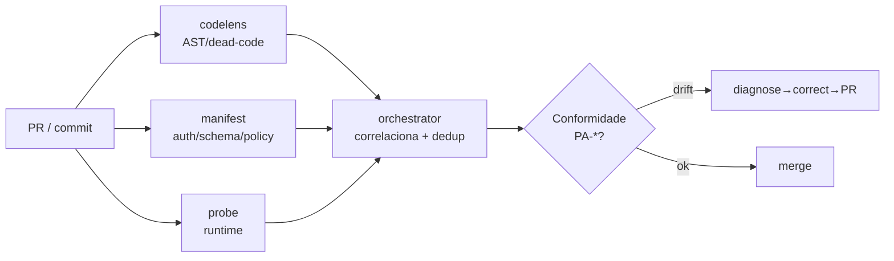

# Fases G & H — Architecture Governance & Change Management

> **TOGAF ADM · Phase G (Implementation Governance) e Phase H (Architecture Change Management).** Como garantir que a implementação siga a arquitetura-alvo, e como a própria EA evolui sem virar documento morto.

---

## 1. Modelo de governança de implementação (Phase G)

### 1.1 Architecture Contract (contrato de conformidade)

Todo trabalho de implementação que toca um pilar de plataforma ou cria um novo produto adere aos **princípios PA-01..08** ([00-preliminary.md](00-preliminary.md)). O contrato é verificável:

| Princípio | Verificação automatizável | Onde |
|---|---|---|
| PA-01 Identidade centralizada | Existe client registrado + sync de permissões? | `register-*-client.ts`, `permissions.json` |
| PA-02 IA via gateway | App importa adapter LLM direto? (anti-padrão) | grep por `@anthropic-ai/sdk`, `openai` fora do gateway |
| PA-03 Reuso de pacotes | Capacidade transversal reimplementada? | review de PR |
| PA-04 Auditoria fail-closed | Listener de auditoria presente? | `HibernateAuditEventListener`, `audit-chain` |
| PA-05 Deploy reprodutível | Tem Dockerfile + healthcheck + migrations? | CI |
| PA-06 Multi-tenant | Queries filtram por `organization_id`? | review + RLS |
| PA-07 ADR antes do código | Mudança de padrão tem ADR aprovada? | `docs/adr/` |
| PA-08 Evidência | Afirmações citam `arquivo:linha`? | review |

### 1.2 O papel do Sentinel na governança (auto-conformidade)

A NuPTechs tem uma vantagem rara: **o pilar P4 (Sentinel) já é um motor de governança automatizada.** O `manifest` gera Policy Matrix e OPA Rego a partir do código; o `orchestrator` correlaciona findings e detecta permission drift. No alvo, a conformidade com PA-01/02/06 pode ser **verificada continuamente pelo próprio Sentinel** — a EA deixa de depender de revisão manual.

### 1.3 Fluxo de trabalho de implementação (já maduro)

O parque já opera um fluxo de entrega disciplinado (do `easynup/AGENTS.md`):
- Branches via **worktree** isolado (suporta múltiplas sessões paralelas).
- PR via **merge commit** (nunca squash/rebase em main — já causou perda de trabalho).
- **Conventional commits**, auto-merge solo-dev.
- HML automático no push para `main`; produção manual.
- Monitoramento de deploy com auto-rollback.

Este fluxo é **referência de governança de implementação** e deve ser estendido aos repositórios que ainda não o seguem (satélites em Replit).

---

## 2. Governança de decisões — ADRs

### 2.1 Estado atual
- **easynup:** 42 ADRs (ADR-001..051) — governança madura, referência do parque.
- **Suite Sentinel:** ADRs próprios (ex: ADR-044 dev-loop, ADR-0003 multi-tenant).
- **nup-platform:** 8 ADRs (0001..0008).
- **NuPIdentify:** ADRs (ex: ADR-0014 Client Integration Pattern v2).
- **Demais satélites:** sem governança ADR.

### 2.2 Alvo
- **ADRs corporativos** (decisões cross-repo, como "adotar nupai-gateway como pilar P3") vivem em `nup-platform/docs/adr/` ao lado desta EA.
- **ADRs de produto** continuam no repo do produto.
- Esta EA referencia ADRs; ADRs referenciam princípios PA-*.

### 2.3 ADRs corporativos propostos (a criar)

| ADR proposto | Decisão | Onda |
|---|---|---|
| **ADR-EA-001** | NuPIdentify como IdP único obrigatório do parque | 1 |
| **ADR-EA-002** | nupai-gateway como ponto único de IA | 2 |
| **ADR-EA-003** | Docker+Railway como padrão de deploy de produção | 3 |
| **ADR-EA-004** | `@nuptechs/audit-chain` como cadeia de auditoria padrão | 3 |
| **ADR-EA-005** | Padrão de tenant key (`organization_id` direto) | 3 |

---

## 3. Gestão de mudança da arquitetura (Phase H)

### 3.1 Quando a EA é revisada

| Gatilho | Ação |
|---|---|
| **Onda de consolidação concluída** | Atualizar matriz de adoção (Fase C) e métricas de sucesso |
| **Novo produto/repositório** | Adicionar ao catálogo + classificar no quadrante (Fase B) |
| **Novo pilar ou mudança de pilar** | Revisar Fase A + criar ADR corporativo |
| **Princípio violado repetidamente** | Revisar o princípio (talvez esteja errado) ou reforçar governança |
| **Decisão de arquivar produto** | Mover para seção "arquivados" do catálogo |

### 3.2 Classificação de mudança (TOGAF)

- **Mudança de simplificação** (incremental): adotar um pacote, migrar um app ao IdP → não exige novo ciclo ADM completo, só atualização da fase afetada.
- **Mudança incremental** (estende capacidade): novo produto vertical → atualiza Fases B/C/D.
- **Mudança de re-arquitetura** (muda pilar): trocar o gateway de IA, mudar IdP → novo ciclo ADM + ADR corporativo + aprovação do patrocinador.

### 3.3 Métricas de saúde da arquitetura (KPIs)

Acompanhadas a cada revisão:

| KPI | Baseline (2026-06-02) | Alvo |
|---|---|---|
| % produtos via NuPIdentify | ~70% | 100% |
| Nº de stacks de IA paralelos | 5+ | 1 |
| % serviços de produção fora do Replit | ~70% | 100% |
| Nº de cadeias de auditoria distintas | 2+ | 1 |
| % repositórios catalogados e classificados | 100% (esta EA) | 100% mantido |
| Nº de segredos versionados | ≥1 (Orbit) | 0 |

---

## 4. Riscos de governança e mitigação

| Risco | Mitigação |
|---|---|
| **EA vira documento morto** | Vincular revisão a ondas concretas; KPIs medidos; Sentinel automatiza conformidade |
| **Founder-bus-factor** | A EA + ADRs codificam conhecimento tácito — este é parte central do valor do documento para due diligence de investidor |
| **Consolidação trava entrega de feature** | Ondas incrementais; cada uma entrega valor isolado |
| **Resistência a abandonar satélites** | Decisão de portfólio explícita e assinada (Onda 0) |
| **Gateway de IA não amadurece** | Piloto valida antes de migração em massa; rollback é manter adapter atual |

---

## 5. Conclusão do ciclo ADM

Esta EA fecha o primeiro ciclo completo do ADM para a NuPTechs:

- **Preliminary** estabeleceu princípios e governança.
- **A** definiu a visão de plataforma e a tese de 4 pilares.
- **B/C/D** mapearam negócio, dados, aplicações e tecnologia com evidência real.
- **E/F** produziram o roadmap de consolidação em 4 ondas.
- **G/H** definiram como governar a implementação e evoluir a arquitetura.

O parque NuPTechs **já tem os ativos de uma plataforma de classe corporativa**. O trabalho à frente não é construir — é **consolidar a adoção** dos pilares que já existem, transformando 24 repositórios que *parecem* uma plataforma numa plataforma que *é* uma. Esse é simultaneamente o caminho de menor custo técnico e a narrativa mais forte para investidor.

---

### Próximo ciclo
Recomenda-se revisar esta EA após a **Onda 0 (higiene + decisão de portfólio)** concluída — momento em que o escopo dos produtos a consolidar estará travado e as Fases B/C/D poderão ser atualizadas com o portfólio racionalizado.

[← Voltar ao índice](README.md)
