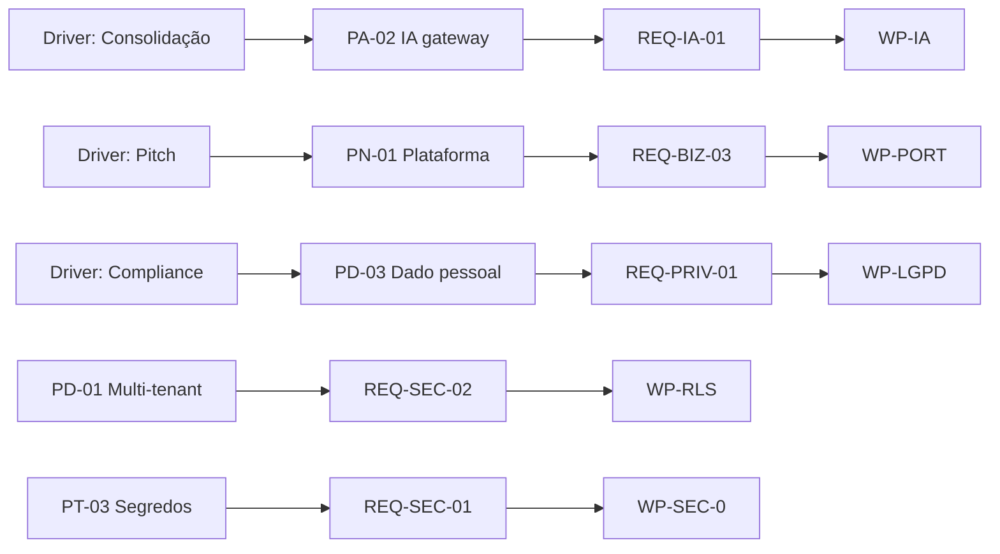

# Architecture Requirements Specification (ARS)

> **TOGAF — Requirements Management (núcleo do ADM).** Especificação formal e rastreável dos requisitos de arquitetura. Cada requisito é mensurável, priorizado (MoSCoW), ligado a um princípio/driver e a um work package. É o contrato verificável que a implementação deve satisfazer — o coração que toda fase do ADM alimenta e consome.

**Convenção de prioridade (MoSCoW):** M=Must · S=Should · C=Could · W=Won't(agora).
**Rastreabilidade:** cada REQ → Princípio ([catálogo](catalogs/principles-catalog.md)) → Gap/WP ([matriz](matrices/consolidated-gaps-solutions-dependencies.md)) → Risco ([register](cross-cutting/risk-register.md)).

---

## 1. Requisitos de Segurança (REQ-SEC)

| ID | Requisito | Critério de aceite (mensurável) | Pri | Princípio | WP | Risco |
|---|---|---|---|---|---|---|
| REQ-SEC-01 | Nenhum segredo versionado no parque | `gitleaks` em CI = 0 findings; 3 segredos atuais rotacionados + histórico purgado | **M** | PT-03 | WP-SEC-0 | R1,R8 |
| REQ-SEC-02 | Isolamento multi-tenant ativo em camada de dado (RLS) | RLS com `FORCE` + role não-superuser; teste de integração cross-tenant falha sem `org_id` | **M** | PD-01 | WP-RLS | R2 |
| REQ-SEC-03 | Regressão cross-tenant detectável em CI | Teste negativo por entidade nova (`byOrganization`) como gate | **M** | PD-01 | WP-RLS | R3 |
| REQ-SEC-04 | Cadeia de auditoria fail-closed e íntegra | Prod bloqueia boot sem `AUDIT_HASH_SECRET`; `/verify-integrity`=🟢; ArchUnit garante listener registrado | **M** | PT-02 | WP-AUDIT | R12 |
| REQ-SEC-05 | Salt de anonimização LGPD separado do segredo de auditoria | Duas chaves distintas; compromisso de uma não afeta a outra | **S** | PT-02 | WP-AUDIT | R6 |
| REQ-SEC-06 | Step-up (re-auth MFA) em ato de alto impacto | Glosa/erasure/lançamento financeiro exigem ACR elevado | **S** | PA-01 | WP-STEPUP | R7 |
| REQ-SEC-07 | Webhooks com HMAC constant-time + anti-replay + CIDR real | Janela ≤300s; allowlist CIDR completa (não octet-prefix) | **S** | PT-02 | — | R9 |
| REQ-SEC-08 | hml nunca contém dado de tenant de produção | Política + verificação; senão, cadeia hml forjável (fallback key) | **M** | PT-02 | — | R6 |

---

## 2. Requisitos de Privacidade / LGPD (REQ-PRIV)

| ID | Requisito | Critério de aceite | Pri | Princípio | WP | Risco |
|---|---|---|---|---|---|---|
| REQ-PRIV-01 | Direito do titular completo (Art. 18) | `exerciseDataSubjectRight.v1` varre **todas** as 12 entidades (transitivas via FK), não só `contract` | **M** | PD-03 | WP-LGPD | R4 |
| REQ-PRIV-02 | DPIA/RIPD para biometria de menores (NuP-School) | RIPD aprovado; consentimento de responsável; avaliar evitar face-match | **M** | PN-02/PD-03 | WP-DPIA | R5 |
| REQ-PRIV-03 | ROPA (registro de operações) mantido | Inventário de tratamento por produto/finalidade/base legal | **M** | PD-03 | WP-DPIA | — |
| REQ-PRIV-04 | Retenção por base legal aplicada | `DataRetentionPolicy` + scheduler ativos; ERASURE bloqueia dentro de janela legal | **S** | PD-03 | — | — |
| REQ-PRIV-05 | Minimização — ACCESS não retorna payload | Verificado em código (já atende); manter em regressão | **S** | PD-03 | — | — |

---

## 3. Requisitos de Identidade & Acesso (REQ-ID)

| ID | Requisito | Critério de aceite | Pri | Princípio | WP |
|---|---|---|---|---|---|
| REQ-ID-01 | 100% dos produtos com usuário autenticam via NuPIdentify | Services/Chunks/Orbit/AIHub/Salon migrados; 0 auth própria nova | **M** | PA-01 | WP-ID |
| REQ-ID-02 | SDK de cliente único adotado | `@nuptechs/nupidentity-sdk` (v2) substitui os 5 padrões atuais | **S** | PAp-02 | WP-ID-SDK |
| REQ-ID-03 | Manifesto de permissões + sync no startup | Todo produto registra `permissions.json`; `[IdentitySync] Sync OK` | **M** | PD-02 | WP-ID |
| REQ-ID-04 | ABAC/ReBAC disponíveis adotados onde fazem sentido | ReBAC além do School; ABAC além de 0/5 apps (ADR-0014) | **C** | PA-01 | WP-ID-SDK |

---

## 4. Requisitos de IA (REQ-IA)

| ID | Requisito | Critério de aceite | Pri | Princípio | WP |
|---|---|---|---|---|---|
| REQ-IA-01 | Toda IA flui pelo nupai-gateway | 0 stacks LLM paralelos; custo observável num ponto | **M** | PA-02 | WP-IA |
| REQ-IA-02 | Gateway tem deploy de produção | Dockerfile + railway + healthcheck; on-prem-capaz | **M** | PT-01 | WP-IA-0 |
| REQ-IA-03 | RAG com isolamento multi-tenant governado | Namespace por tenant validado no gateway | **M** | PD-01 | WP-IA |
| REQ-IA-04 | IA assistiva e auditável (citação verificada) | Saída em fluxo de contrato cita fonte; nunca aciona efeito sozinha | **M** | PN-03 | — |
| REQ-IA-05 | Provider fungível por configuração | Trocar Anthropic↔OpenAI↔Ollama sem refactor (porta) | **S** | PAp-01 | WP-IA-2 |

---

## 5. Requisitos de Plataforma / Reuso (REQ-PLAT)

| ID | Requisito | Critério de aceite | Pri | Princípio | WP |
|---|---|---|---|---|---|
| REQ-PLAT-01 | Capacidade transversal via `@nuptechs/*` | Pagamento/billing/messaging/voice não reimplementados | **M** | PAp-02 | WP-DEDUP |
| REQ-PLAT-02 | Pagamento sempre pela porta `payments-core` | 0 `new Stripe()` direto em produto; versão de API única | **S** | PAp-01 | — |
| REQ-PLAT-03 | Consumidores ≤1 minor atrás do publicado | Renovate/bot de bump; Sales sai da 0.1.x | **C** | — | WP-VER |

---

## 6. Requisitos de Tecnologia / Operação (REQ-TECH)

| ID | Requisito | Critério de aceite | Pri | Princípio | WP |
|---|---|---|---|---|---|
| REQ-TECH-01 | 0 serviços de produção em Replit | study/Services/Chunks/kan/AIHub em Docker/Railway | **M** | PT-01 | WP-INFRA |
| REQ-TECH-02 | Observabilidade OTel padrão nos produtos core | Tracing+métricas+logs estruturados | **S** | PT-04 | WP-OBS |
| REQ-TECH-03 | Banco em Postgres gerenciado (sair de Neon/Mongo) | Services/kan migrados | **C** | PT-01 | WP-INFRA |
| REQ-TECH-04 | Deploy reprodutível (Dockerfile+healthcheck+migrations) | Todo serviço deployável conforme template | **M** | PT-01 | WP-INFRA |

---

## 7. Requisitos de Produto / Negócio (REQ-BIZ)

| ID | Requisito | Critério de aceite | Pri | Princípio | WP |
|---|---|---|---|---|---|
| REQ-BIZ-01 | Conformidade Lei 14.133 modelada no domínio gov | Glosa fundamentada (ADR-049); TRP/TRD; arcabouço legal | **M** | PN-02 | — (entregue) |
| REQ-BIZ-02 | Loop self-healing fecha (teste real) | LocalTestRunner executa testes; itera até passar (ADR-044 Onda 2) | **C** | — | WP-SELFHEAL |
| REQ-BIZ-03 | Portfólio racionalizado | Cada repo: consolidar/reposicionar/arquivar decidido | **S** | PN-01 | WP-PORT |
| REQ-BIZ-04 | Compliance gov BR potencialmente extraível como pacote | Avaliar `@nuptechs/compliance-govbr` reusável | **W** | PN-01 | WP-COMP |

---

## 8. Matriz de rastreabilidade (resumo)

---

## 9. Critérios de conformidade (Definition of Done arquitetural)

Um produto é declarado **"cidadão pleno da plataforma"** quando satisfaz: REQ-ID-01, REQ-ID-03, REQ-IA-01, REQ-PLAT-01, REQ-SEC-01, REQ-TECH-04 (checklist em [technology-standards §5](catalogs/technology-standards.md)). Hoje **nenhum produto satisfaz 100%** — o easynup é o mais próximo (falta REQ-IA-01 e REQ-PLAT-01). Esse delta é exatamente o trabalho das ondas.
