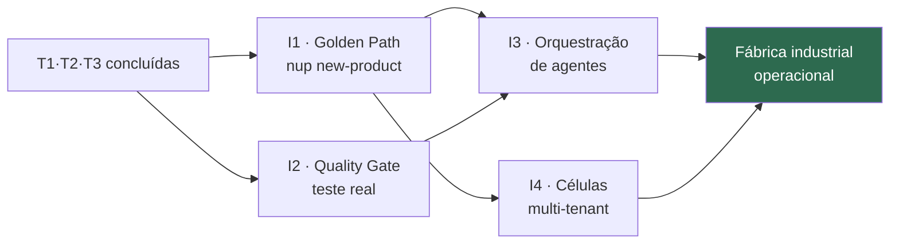

# ADR-EA-006 — NuPTechs como Fábrica de Software (IDP + golden paths + SDLC agentic + multi-tenancy celular)

| | |
|---|---|
| **Status** | ✅ Accepted (direção arquitetural; **industrialização condicionada à conclusão de T1–T3**) |
| **Data** | 2026-06-03 |
| **Decisor** | Yuri F. (Architecture Owner) |
| **Princípio** | [PN-01 Plataforma sobre produtos](../catalogs/principles-catalog.md) |
| **Requisitos** | REQ-BIZ-02, REQ-BIZ-03, REQ-PLAT-01, REQ-IA-02, REQ-SEC-02, REQ-TECH-01/04 |
| **Onda** | pós-T3 ("Industrializar") — depende de T1, T2, T3 |
| **Referências** | [Software Factory Target](../target-at-scale/software-factory-target.md) · [TRM/III-RM](../target-at-scale/technical-reference-model.md) · [Golden Path](../target-at-scale/golden-path-new-product.md) |

---

## Context

A NuPTechs já opera, **artesanalmente**, o método de uma fábrica de software AI-native: um founder + N sessões Claude em paralelo, cada uma `worktree → PR → merge → deploy → monitor → self-heal`, com Sentinel como camada de governança/qualidade e os 4 pilares como plataforma. A pesquisa de mercado 2026 (platform engineering, golden paths, agentic SDLC, multi-tenancy celular — ver [benchmark §6](../benchmark/ea-benchmark-world-class.md)) confirma que esse é exatamente o padrão emergente de classe mundial — só que a indústria está *começando* a nomeá-lo, enquanto a NuPTechs já o pratica.

O ativo é o **método já em uso**; a dívida é **não tê-lo plataformizado**: golden paths não existem como código reusável, o loop de qualidade não fecha (sem teste real), a multi-tenancy não escala (RLS dormente), e cada produto novo é montado à mão repetindo padrões.

Sem uma decisão explícita, há dois riscos opostos: (a) **nunca industrializar** (continuar artesanal, sem escalar) ou (b) **industrializar cedo demais** (construir um IDP especulativo antes de os padrões estarem maduros — over-engineering).

## Decision

**A NuPTechs adota explicitamente o paradigma de Fábrica de Software** como arquitetura-alvo de escala, com quatro componentes:

1. **Internal Developer Platform (IDP) composable** — os 4 pilares + `nup-platform` são os building blocks; o `nup-suite` evolui para o plano de controle. A plataforma é tratada **como produto** (roadmap, versionamento, clientes), não como infra.

2. **Golden Paths** — rotas opinativas, automatizadas e com *escape hatch* (via ADR). O primeiro é [`nup new-product`](../target-at-scale/golden-path-new-product.md) (instanciar um vertical SaaS). Substituem os 5 padrões divergentes de auth/IA/deploy por um caminho conforme.

3. **SDLC Agentic Governado** — formaliza a prática atual: execução paralela de agentes + **review em 2 camadas** (Camada 1 agente/Sentinel; Camada 2 humano) + **quality gate com teste real** (fechar ADR-044 Onda 2 — `LocalTestRunner`) + tudo sob política única (NuPIdentify ABAC + cadeia HMAC).

4. **Multi-tenancy Celular** — tier × cell × infra-group; novo tenant = mudança de config. **Condicionado ao RLS ativo** (ADR-EA-005).

**Condição de industrialização (gate explícito):** os golden paths e a célula **só são construídos após T1–T3 concluídas**. Antes disso, padroniza-se apenas o que *já se repete* (não se especula). Isto evita o over-engineering — a regra é "industrializar o que comprovadamente funciona, não o que se imagina".

## Consequences

- **Positivas:**
  - Time-to-new-product cai de semanas (artesanal) para dias (golden path).
  - Onboarding de tenant vira config; escala a muitos clientes por produto.
  - Qualidade verificável (teste real) + trilha de auditoria do próprio SDLC.
  - Diferencial de mercado raro: fábrica AI-native + governança HMAC + on-prem + compliance de domínio — o pitch do ADR-044 ancorado no estado-da-arte 2026.
  - Reduz o bus-factor (o método vira plataforma, não conhecimento tácito do founder).

- **Custos / riscos:**
  - Depende de T1 (RLS ativa), T2 (gateway deployado), T3 (loop de qualidade fechado) — não pode pular a fila.
  - Risco de golden path virar camisa-de-força → mitigado pelo escape hatch obrigatório.
  - Custo de IA pode crescer com a fábrica → mitigado por ADR-EA-002 (gateway como ponto único de custo).
  - Orquestração de paralelismo de agentes sem governança = caos → agentes plugados no NuPIdentify + HMAC antes de orquestrar em escala.

- **Rejeitadas:**
  - *"Adotar um IDP de prateleira (Backstage) agora"* — overkill para founder solo; reavaliar quando houver time de plataforma (ver [benchmark](../benchmark/ea-benchmark-world-class.md)).
  - *"Industrializar antes de T1–T3"* — over-engineering; viola o gate.

---

## Plano de Industrialização (pós-T3) — 4 marcos

> Pré-condição: T1 (segurança/RLS), T2 (IA unificada), T3 (qualidade/infra) concluídas. Cada marco é entregável e mensurável.

### I1 — Golden Path `nup new-product` (a linha de montagem)
- Empacotar no `nup-suite`: scaffold hexagonal + Dockerfile + CI + registro no IdP + plug de pacotes `@nuptechs/*` + recipe de IA + Sentinel ligado + deploy.
- **Saída:** um comando instancia um vertical conforme em < 1 dia. Spec: [golden-path-new-product](../target-at-scale/golden-path-new-product.md).
- **KPI:** time-to-new-product < 2 dias; novo produto nasce com 100% dos pilares plugados.

### I2 — Quality Gate com teste real (fechar o loop self-healing)
- Implementar `LocalTestRunner` (sandbox) plugado ao `CorrectionService` do Sentinel: `fix → test → re-test até passar`.
- Integrar Playwright Test Agents (já há captura no probe) ao verify.
- **Saída:** ADR-044 Onda 2 fechada — "self-healing verificado", não "auto-correção plausível".
- **KPI:** % de correções do Sentinel que passam em teste real antes do PR.

### I3 — Orquestração de paralelismo de agentes
- Orquestrador (estilo Sentinel/workflow) que distribui tarefas independentes a N agentes e coleta — "team-scale output from a single developer".
- Agentes operam sob política única: NuPIdentify (ABAC/ReBAC) + cadeia HMAC (trilha de auditoria do SDLC).
- **KPI:** nº de tarefas independentes executadas em paralelo por ciclo; trilha de auditoria por agente.

### I4 — Células multi-tenant
- Materializar tier × cell × infra-group; novo tenant = config; cell = blast-radius + residência de dado (soberania gov BR).
- **Pré-condição rígida:** ADR-EA-005 (RLS ativa) — sem isso, pooled multi-tenant é inseguro.
- **KPI:** onboarding de tenant em minutos; falha de uma cell não afeta outras.

---

## Conformidade
Verificável por: (I1) existência e uso do golden path no `nup-suite`; (I2) loop de teste real no Sentinel; (I3) orquestrador com trilha HMAC por agente; (I4) tenant onboarding por config + cells isoladas. Revisão na governança (Architecture Compliance Review recorrente — [benchmark §5](../benchmark/ea-benchmark-world-class.md)).
