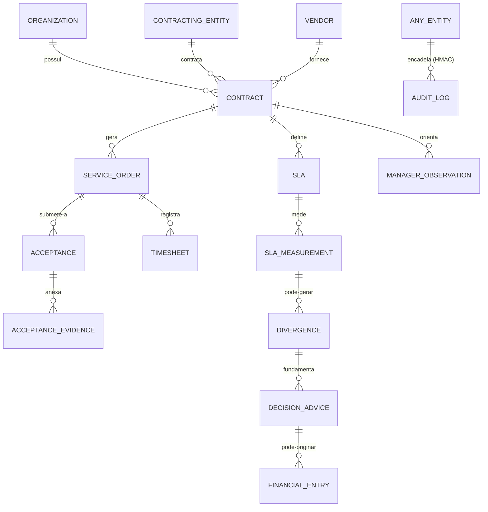

# Data Entity Catalog

> **Artefato TOGAF — Phase C (Data).** Catálogo dos blocos de dado do parque. Foca no flagship (easynup, **210 entidades JPA** — verificado por código, não README) organizado por *bounded context*, e sumariza os domínios de dado dos demais sistemas-dono. Base para a [CRUD Matrix](../matrices/crud-application-data-matrix.md) e a [Data Architecture](../03-data-architecture.md).

**Fonte:** leitura de `src/main/java/easynup/persistence/entities/` e schemas Drizzle dos demais (ver [EVIDENCE-REGISTER](../EVIDENCE-REGISTER.md)). Contagens são de código em `main` @ 2026-06-02.

---

## 1. easynup — 210 entidades por bounded context

### BC-1 · Contratos (núcleo)
`Contract` · `ContractCompany` · `ContractVendor` · `ContractMilestone` · `ContractProject` · `ContractedPhase` · `ContractLegalReference` · `ContractRiskPlaybook` · `ContractBalanceSnapshot` · `ContractBalanceMovement` · `ContractBalanceReservation`
> Agregado-raiz: **Contract**. Multi-tenant: único com `organization_id` **direto** (os demais BCs herdam via FK → contract). Sistema-dono do domínio "Contratos públicos".

### BC-2 · Ordens de Serviço & Profissionais
`ServiceOrder` · `ServiceOrderProfessional` · `Professional` · `ProfessionalSubstitution` · `Timesheet` · `TimesheetTemplate`
> PII: dados de profissional. Multi-tenant transitivo via `contract_id`.

### BC-3 · Aceite / SLA / Divergências
`Acceptance` · `AcceptanceStageConfig` · `AcceptanceStageExecution` · `AcceptanceEvidence` · `Sla` · `SlaIndicator` · `SlaMeasurement` · `SlaPenaltyRecord` · `SlaTemplate` · `Divergence` · `DivergenceInteraction`
> Realiza TRP/TRD (Lei 14.133 art. 140). Aceite multi-estágio configurável.

### BC-4 · Financeiro
`FinancialEntry` · `FinancialEntryStatusChange` · `Deflator` · `TaxRetentionRule`
> Ato financeiro derivado de decisão (não automático — ADR-049). Retenção legal (Decreto 11.246 Art. 22).

### BC-5 · Análises de Tamanho (PF/SNAP/UST/USN)
`PfAnalysis` · `SnapPointAnalysis` · `UstItem` · `NonMensurableItem` · `ServiceClassAnalysis` · `CountMethod`
> Métricas IFPUG/SNAP. **Sobreposição** com nup-aim (FPA) — candidato a consolidação (gap G8).

### BC-6 · Schema-as-Code (configurabilidade)
`ConfigDefinition` · `ConfigVersion` · `ConfigDraft` · `ConfigDraftApproval` · `ConfigEnvironmentBinding` · `AiPipelineExample`
> Domains: `CUSTOM_FIELD, WORKFLOW, RULE, PLAYBOOK, SLA, REF_TABLE, AI_PIPELINE`. Versionamento com aprovação (two-eyes).

### BC-7 · Workflow Engine (DMN/BPMN-style, ~30 entidades)
`WorkflowTemplate` · `WorkflowEvent` · `WorkflowTimerEvent` · `WorkflowIncident` · `WorkflowCompensation` · `BusinessKnowledgeModel` · `DecisionService` · `Rule` · `RuleAction` · `RuleCondition` · `HumanTask` …
> Motor de regras com FEEL/DMN hit-policies. É um Application Component substancial, não vaporware.

### BC-8 · IA / Diretrizes / Apoio à Decisão
`ManagerObservation` · `ManagerObservationScope` · `OrganizationGuidelineInjectionConfig` · `DecisionAdvice` · `AnalyzerPlaybook` · `AnalyzerOrgConfig` · `ExecutionFinding` · `EntityEmbedding`
> Diretriz do Gestor (ADR-045/046), apoio à decisão (ADR-049). RAG isolado por namespace `guidelines-<org>`.

### BC-9 · Arcabouço Legal / Compliance
`LegalReference` · `LegalObligation` · `LegalFrameworkRule` · `ComplianceArtifact` · `ComplianceAssessment` · `ComplianceFinding`
> Onde Lei 14.133/Decreto 11.246 é modelada (ADR-010). **Diferencial real de domínio.**

### BC-10 · Multi-tenant / Identidade local
`Organization` · `ContractingEntity` · `Vendor` · `User` · `Group` · `Permission` · `UserPermission` · `GroupPermission`
> `Permission` espelha o catálogo do NuPIdentify (621 keys, sync no startup). Schema real de `permission`: `id, name, description, display_name, jpa_version` (sem `code`/`category`).

### BC-11 · Custom Fields / LGPD / Audit / Webhooks / Conectores
`CustomFieldDefinition` (legacy, ADR-051 retira) · `HasCustomFields` (interface) · `DataRetentionPolicy` · `AuditLog` · `SecurityEvent` · `WebhookEndpoint` · `WebhookExecutionLog` · `Connector`
> Custom Fields v2 migra para JSONB+JSON Schema (ADR-051, em cutover). `AuditLog` é o ledger HMAC.

---

## 2. Dado pessoal / classificação LGPD (easynup)

| Entidade | Dado pessoal | Sensibilidade | Base de retenção |
|---|---|---|---|
| `Professional`, `ServiceOrderProfessional` | Nome, CPF, vínculo | Comum | Contratual (Decreto 11.246 Art. 22) |
| `Vendor`, `VendorBankAccount` | CPF/CNPJ, dado bancário | Financeiro | Legal |
| Custom Fields (`PiiScanner`) | Variável (detectado) | Comum/sensível | Por configuração |
| `User` | Credencial, identidade | Comum | Enquanto ativo |

> Direito do titular: `exerciseDataSubjectRight.v1` cobre ACCESS/EXPORT/ERASURE/ANONYMIZATION — **mas hoje varre só `contract`** (as 11 transitivas são puladas, R4 — defeito de completude legal).

---

## 3. Domínios de dado dos demais sistemas-dono (resumo)

| Sistema | Schema | Nº entidades | Dado pessoal / sensibilidade |
|---|---|---|---|
| **NuPIdentify** | `shared/schema/` (Drizzle, particionado) | identity/rbac/abac/rebac/oidc/saml/scim/licensing/billing | Credenciais, MFA secrets, sessões, tuplas ReBAC — **núcleo de identidade** |
| **NuP-School** | `server/db/schema.ts` + 17 módulos | ~46 tabelas | 🔴 **Máxima** — menores: nome, CPF, responsável, **biometria (foto-prova)**, saúde escolar. LGPD Art. 11 + Art. 14 |
| **nup-study** | `nup_study.*` | **98 tabelas** | 🟠 Alta — alunos, **dificuldade de aprendizagem (saúde, Art. 11)**, consent WhatsApp/Telegram |
| **NuP-Sales** | hexagonal Drizzle | 24 tabelas | 🟡 Média — CPF, endereço, `payments` |
| **kan** | `shared/schema.ts` | 20 tabelas | 🟢 Baixa — email/senha; híbrido Postgres+MongoDB |
| **nup-aim** | `nup_aim.*` | 11 tabelas | 🟢 Baixa — email/senha (⚠️ JWT secret versionado) |
| **NuP-Salon-Client** | (cliente — sem DB local) | 0 | Token/user em AsyncStorage |
| **nupai-gateway** | `infra/postgres/00*.sql` | project/usage/recipe/semantic-cache | API keys (hash), usage ledger |
| **nup-sentinel** | Postgres | Session/Finding/CaptureEvent/BlastRadius | Findings de código (não PII de usuário final) |

---

## 4. Modelo conceitual de dado (alto nível, flagship)

> Toda entidade transita pela cadeia `AUDIT_LOG` (HMAC) via listener Hibernate. `DECISION_ADVICE` substitui a glosa automática (ADR-049): SLA→Divergência→fundamentação→opção→ato humano→FinancialEntry.

---

## 5. Observações de governança de dado

1. **Eixo de tenant inconsistente** — só `contract` tem `organization_id` direto; padronizar (denormalizar nas 11 transitivas) destrava RLS (R2) e completa o direito LGPD (R4).
2. **Bancos dispersos** — Neon (Services, kan), cluster compartilhado School↔Salon, Replit (study, Chunks, AIHub). Consolidar em Postgres gerenciado.
3. **Dado vetorial sem governança central** — 6 consumidores de Pinecone; centralizar no gateway (namespace governado por tenant).
4. **Dado sensível de menores (School)** exige DPIA e tratamento Art. 11/14 reforçado antes de qualquer escrutínio público.
