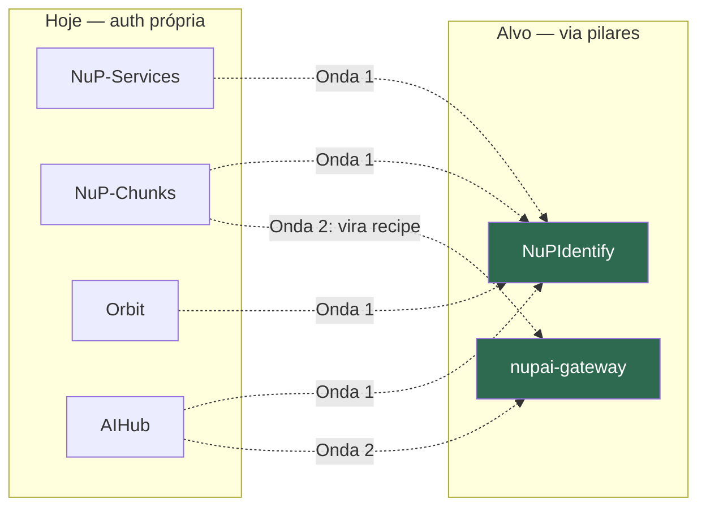

# Matriz de Integrações (Interface Catalog)

> **Artefato TOGAF de conteúdo.** Quem-chama-quem no parque NuPTechs, com evidência. Distingue integração **real** (confirmada no código) de integração **alvo** (proposta pela EA).

---

## 1. Matriz de dependências entre sistemas (real)

| Origem ↓ \ Destino → | NuPIdentify | nup-platform | nupai-gateway | Sentinel | Pinecone | LLM externo | PSP |
|---|:---:|:---:|:---:|:---:|:---:|:---:|:---:|
| **easynup** | OIDC | — | — | MCP | RAG legal | Anthropic | — |
| **NuP-School** | OIDC+ReBAC | 13 pkgs | — | findings | — | ElevenLabs | Stripe |
| **nup-study** | OIDC | — | — | — | RAG | OpenAI+Anthropic+Gemini | — |
| **NuP-Sales** | OIDC/PKCE | payments-core | — | — | — | — | Stripe |
| **NuP-Salon-Client** | — | commerce+kernel | — | — | — | — | Pix |
| **kan** | sync 5min | — | — | — | — | — | — |
| **nup-aim** | OIDC opt-in | — | — | — | — | Gemini | — |
| **Orbit** | — | — | — | — | — | Anthropic+Meta+… | Stripe |
| **NupTechs-AIHub** | — | — | — | — | RAG | Ollama+OpenAI+Anthropic | — |
| **NuP-Chunks** | — | — | — | — | RAG | Mistral+Claude+OpenAI | — |
| **NuP-Services** | — | — | — | — | — | — | — |
| **nup-sentinel** | OIDC/PKCE | — | porta hex | (hub) | — | Anthropic+OpenAI | — |
| **manifest** | OIDC conf. | — | — | Finding v2 | — | OpenAI | — |
| **probe** | — | — | — | webhook HMAC | — | — | — |
| **codelens** | — | — | — | emit | — | Anthropic | — |
| **nuptechs (site)** | — | — | — | — | RAG | OpenAI | — |

---

## 2. Interfaces de integração por protocolo

### 2.1 OIDC / Identidade (→ NuPIdentify)

| Consumidor | Tipo de client | Evidência |
|---|---|---|
| easynup | confidential (clientId/secret, systemId=easynup) | `packages/auth/src/config.js:8,44-50` |
| NuP-School | confidential + ReBAC sync | `server/index.ts:686,704-705` |
| nup-study | OIDC + permissions sync | `openid-client`, `passport`, scripts `sync-permissions` |
| NuP-Sales | PKCE (web + mobile) | clients `nup-sales`, `nup-sales-mobile` |
| kan | JWT validate + sync 5min | `identitySyncService.ts`, `.env.example:13` |
| nup-aim | OIDC opt-in (SDK vendorizado) | `server/nupidentity.ts:4-8,40` |
| nup-sentinel | PKCE public | `scripts/register-oidc-client-in-identify.js --public` |
| manifest | auth_code confidential | `nupidentity-client-manifest.json` |

> Padrão de integração: o consumidor registra um client (`register-*-client.ts` no IdP) + envia manifesto de permissões no startup; o IdP cria as linhas de permissão locais (`[IdentitySync] Sync OK`).

### 2.2 Pacotes compartilhados (→ nup-platform via GitHub Packages)

| Consumidor | Pacotes `@nuptechs/*` | Evidência |
|---|---|---|
| NuP-School | billing, billing-school, payments-core, payment-link, voice-agent-*, platform-ports/adapters, shared-kernel (13) | `package.json:30-42` |
| NuP-Sales | payments-core (bridge) | adapters out/payment |
| NuP-Salon-Client | commerce, shared-kernel | `package.json` (vendor tgz) |
| easynup | nup-xlsx-preview | `frontend/package.json:28` |
| NuPIdentify | shared-kernel, payments-core, outbox-worker | dependencies |

### 2.3 Sentinel — emissão de findings (→ nup-sentinel)

| Emissor | Mecanismo | Evidência |
|---|---|---|
| codelens | `npx github:nuptechs/nup-sentinel-code emit` (cron clona repos-alvo) | `src/jobs/codelens-emit.job.js:1-30` |
| manifest | POST Finding v2 `source=auto_manifest` (API key `key:orgId`) | `server/security/sentinel-emitter.ts` |
| probe | webhook HMAC-SHA256 `session.*` (anti-replay 5min) | `probe-webhooks.js` |
| easynup | correlação cross-process via `metadata.probeSessionId` | (memória de sessão confirmada) |

### 2.4 LLM / IA (→ providers externos) — **a fragmentação**

| Consumidor | Provider(s) | Vetor |
|---|---|---|
| easynup | Anthropic (porta hex `completion.port`) | Pinecone+pgvector (`legal-*`, `guidelines-*`) |
| nup-study | OpenAI + Anthropic + Gemini | Pinecone |
| nup-aim | Gemini (primário) | — |
| Orbit | Anthropic + Meta/LinkedIn/YouTube/HeyGen | — |
| NupTechs-AIHub | Ollama → OpenAI → Anthropic | Pinecone `nuptechs-contracts-v2` |
| NuP-Chunks | Mistral + Claude + OpenAI | Pinecone |
| nup-sentinel | Anthropic (AIPort) | OpenAI embeddings |
| codelens | Anthropic | — |
| nuptechs site | OpenAI | Pinecone |
| **nupai-gateway** | **todos (via porta)** | Pinecone+pgvector |

> 9 consumidores de LLM, 5 providers, 6 consumidores de Pinecone — **nenhum via o gateway**. Esta tabela é a evidência visual do gap G1.

---

## 3. Sistemas externos (saída do parque)

| Sistema externo | Consumido por | Finalidade |
|---|---|---|
| **gov.br / PNCP** | easynup | Integração setor público |
| **Stripe** | NuPIdentify, School, Sales, Orbit | Pagamentos/billing |
| **MercadoPago** | nup-platform (payments) | PSP alternativo |
| **Anthropic** | easynup, study, Orbit, AIHub, Chunks, sentinel, codelens | LLM |
| **OpenAI** | study, AIHub, Chunks, sentinel, manifest, site | LLM/embeddings |
| **Google Gemini** | nup-aim, study, AIHub | LLM |
| **Ollama** | AIHub | LLM local |
| **Mistral** | NuP-Chunks | embeddings |
| **Pinecone** | easynup, study, AIHub, Chunks, gateway, site | Vetor/RAG |
| **Tolgee** | easynup | i18n |
| **ElevenLabs** | School, study, Orbit | Voice |
| **mediasoup** | School, nup-platform | Conferência SFU |
| **WhatsApp/Telegram** | study, Sales, Orbit, Salon | Mensageria |
| **Meta/LinkedIn/YouTube** | Orbit | Publicação de conteúdo |
| **SendGrid/Resend** | NuPIdentify, kan, Orbit, study | Email |
| **GCS / Neon** | NuPIdentify/study (GCS), Services/kan (Neon) | Storage/DB |

---

## 4. Acoplamentos a vigiar (riscos de integração)

| Acoplamento | Tipo | Risco |
|---|---|---|
| **NuP-School ↔ NuP-Salon** (banco Postgres compartilhado 5433) | Dado | Mudança de schema de um afeta o outro |
| **AIHub → Ollama via túnel Cloudflare** (URL muda a cada restart) | Infra | Dependência frágil de produção |
| **easynup gateway proxia só `/easynup/*`** | API | Endpoints REST `/api/v1/*` precisam de proxy explícito (pitfall recorrente) |
| **`AUDIT_HASH_SECRET` cross-process** | Segurança | Segredo precisa ser idêntico Java↔Node; fallback de dev em prod quebra a cadeia |
| **5 consumidores de Pinecone sem governança** | Custo/Dado | Sem isolamento/custo central |

---

## 5. Integrações-alvo (propostas pela EA)

Detalhe do sequenciamento em [../06-opportunities-migration.md](../06-opportunities-migration.md).
