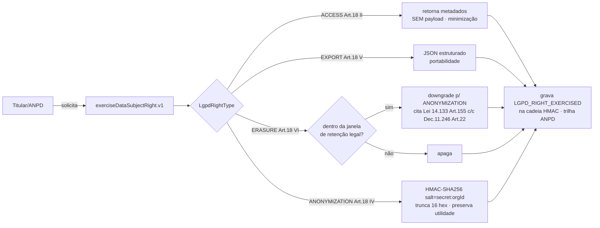

# Privacy & LGPD Architecture (cross-cutting)

> **TOGAF — visão transversal de privacidade.** Mapeia onde dado pessoal vive no parque, como os direitos do titular (LGPD Art. 18) são realizados, retenção/base legal, e os pontos que exigem DPIA. É o artefato que um DPO/ANPD leria. Insumo da [ARS §2](../09-architecture-requirements-specification.md) e do [Risk Register](risk-register.md).

**Base legal de referência:** Lei 13.709/2018 (LGPD) + interação com Lei 14.133/2021 e Decreto 11.246/2022 (retenção contratual no setor público).

---

## 1. Inventário de tratamento (ROPA — Registro de Operações)

| Produto | Categorias de titular | Dado pessoal | Sensível (Art. 11) | Menor (Art. 14) | Base legal | Retenção |
|---|---|---|---|---|---|---|
| **NuP-School** | Alunos, responsáveis, profissionais | Nome, CPF, contato, **biometria (foto-prova)**, frequência, ocorrências | 🔴 **Biometria + saúde escolar** | 🔴 **Sim (alunos)** | Consentimento responsável + execução de contrato educacional | A definir (DPIA) |
| **nup-study** | Estudantes | Nome, email, **perfil de aprendizagem (dislexia/TDAH/autismo)**, consent WhatsApp/Telegram | 🟠 **Saúde (dificuldade)** | Possível | Consentimento | A definir |
| **easynup** | Profissionais, fornecedores | Nome, CPF/CNPJ, dado bancário (Vendor) | — | — | Execução de contrato + obrigação legal | **5–10 anos** (Decreto 11.246 Art. 22) |
| **NuP-Sales** | Compradores | CPF, endereço, pagamento | — | — | Execução de contrato | Fiscal |
| **NuPIdentify** | Usuários do parque | Credenciais, MFA, sessões, email | — | — | Execução + legítimo interesse | Enquanto ativo |
| **Orbit/AIM/kan/Chunks** | Usuários | Email, senha | — | — | Execução | — |

> **Concentração de risco:** NuP-School (biometria de menores) e nup-study (dado de saúde) são os dois tratamentos de **alto risco** que exigem DPIA/RIPD. easynup tem dado financeiro com retenção legal longa (não sensível, mas regulado).

---

## 2. Realização dos direitos do titular (Art. 18) — easynup

O easynup é o único com direito do titular implementado como serviço de 1ª classe.

**Qualidades de design (verificadas):**
- ACCESS nunca retorna payload (minimização Art. 6º III, `:273-274`).
- Anonimização determinística com salt por org (isola tenants, preserva estatística, `:321-339`).
- Toda invocação na cadeia HMAC (`:131-142`) → **trilha auditável de atendimento à ANPD**.
- Conflito LGPD↔14.133 resolvido em código: ERASURE de entidade contratual vira ANONYMIZATION citando base legal (`:234-236`).

### 🔴 Defeito de completude (R4)
O serviço **varre apenas `contract`** — as outras 11 entidades (service_order, timesheet, acceptance, divergence…) são multi-tenant **transitivas** (FK→contract) e o serviço **as pula silenciosamente** para evitar leak cross-tenant (`:174-180`). Consequência: uma solicitação de acesso/eliminação da ANPD **hoje não varre** essas tabelas (retorna `matchedRows=0`). É **fail-safe** (não vaza) mas **fail-incomplete** (sub-atende o titular num direito legalmente vinculante). Correção: varredura transitiva via `EXISTS` na FK ou denormalização de `org_id` (WP-LGPD, depende de WP-RLS).

---

## 3. DPIA / RIPD necessários

| # | Tratamento | Por que DPIA | Ação |
|---|---|---|---|
| DPIA-1 | **Biometria facial de menores (NuP-School foto-prova)** | Dado sensível (Art. 11) + menor (Art. 14, melhor interesse) + biometria = alto risco máximo | RIPD obrigatório; consentimento explícito do responsável; avaliar se face-match é evitável; criptografia em repouso; limite de retenção |
| DPIA-2 | **Perfil de aprendizagem (nup-study)** | Dado de saúde (dificuldade: TDAH/dislexia/autismo, Art. 11) | RIPD; base legal de consentimento; minimização |
| DPIA-3 | **IA jurídica com dado de contrato (easynup)** | Decisão assistida sobre fornecedores/profissionais | Avaliar; mitigado por "decisão humana" (ADR-049) e RAG isolado |

---

## 4. Controles de privacidade por design (o que já existe)

| Controle | Estado | Evidência |
|---|---|---|
| Minimização (ACCESS sem payload) | 🟢 | `ExerciseDataSubjectRightServiceV1.java:273` |
| Anonimização reversível-resistente | 🟢 | HMAC salt por org `:321` |
| Trilha de atendimento (auditável) | 🟢 | `LGPD_RIGHT_EXERCISED` na cadeia `:131` |
| Retenção por base legal | 🟢 | `DataRetentionPolicy` + scheduler |
| Isolamento de RAG por tenant | 🟢 | namespaces `legal-internal-<org>` |
| Consentimento (WhatsApp) | 🟢 | `whatsappConsent` (nup-study) |
| **Varredura completa do titular** | 🔴 | só `contract` (R4) |
| **DPIA de menores** | 🔴 | ausente (R5) |
| **ROPA mantido** | 🟡 | este documento é o embrião |

---

## 5. Recomendações priorizadas

| Pri | Ação | REQ |
|---|---|---|
| **P0** | DPIA-1 (biometria de menores NuP-School) | REQ-PRIV-02 |
| **P1** | Completar varredura do direito do titular (11 entidades) | REQ-PRIV-01 |
| **P1** | Formalizar ROPA por produto/finalidade/base legal | REQ-PRIV-03 |
| **P2** | DPIA-2 (perfil de saúde nup-study) | REQ-PRIV-02 |
| **P2** | Separar salt de anonimização do segredo de auditoria | REQ-SEC-05 |
| **P3** | Runbook de atendimento ANPD (SLA de resposta) | REQ-PRIV-01 |

> **Mensagem-chave para o DPO:** a *maquinaria* LGPD do easynup é sofisticada (direitos, anonimização, retenção, trilha auditável) — mas dois itens são bloqueantes para escrutínio: a **biometria de menores sem DPIA** (NuP-School) e a **incompletude da varredura** do direito do titular. Ambos têm caminho claro de correção.
