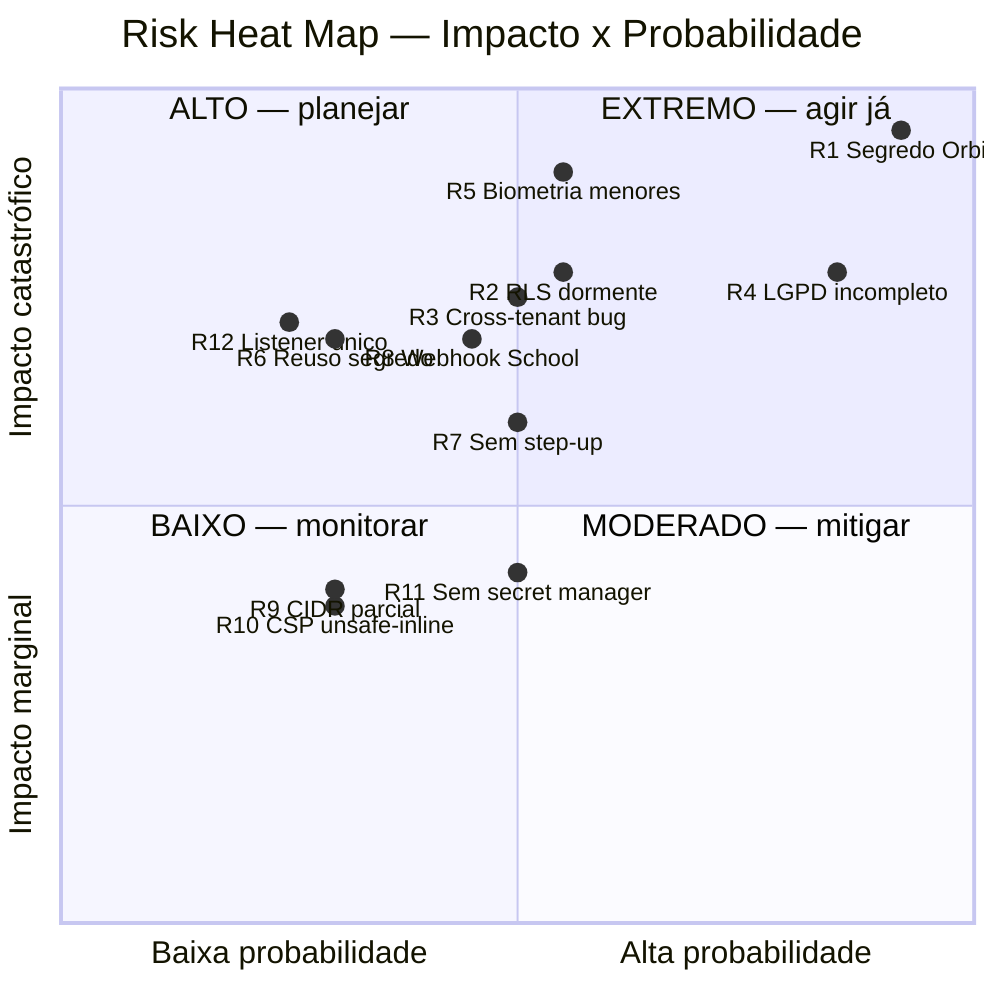

# Risk Register

> **TOGAF — gestão de risco de arquitetura (Phase E + Governance).** Registro formal de riscos arquiteturais, classificados por **impacto × probabilidade** (matriz TOGAF), com risco residual e mitigação rastreada a work packages. Mantido como parte da governança (Fase G).

**Classificação de impacto:** Catastrófico · Crítico · Marginal · Negligenciável.
**Classificação de probabilidade:** Alta · Média · Baixa.
**Risco = Impacto × Probabilidade** → Extremo / Alto / Moderado / Baixo.

---

## 1. Mapa de calor

---

## 2. Registro detalhado

### 🔴 R1 — Chave Anthropic viva versionada em repo público-org (Orbit) · **EXTREMO**
- **Evidência:** `Orbit/docker-compose.yml:28-29` (chave `sk-ant-api03-CQrG...` + `ENCRYPTION_KEY`), git-tracked desde `672c51a`, em `github.com/nuptechs/NuP-Orbit`.
- **Impacto:** Catastrófico (uso indevido faturável da chave; `ENCRYPTION_KEY` compromete cripto-at-rest do Orbit). **Probabilidade:** Alta (já exposta, em histórico imutável).
- **Mitigação (WP-SEC-0):** rotacionar chave na Anthropic *agora*; rotacionar `ENCRYPTION_KEY` + re-encriptar dados; purgar histórico (BFG/filter-repo); mover para env Railway; `gitleaks` pre-commit.
- **Risco residual:** Baixo após rotação+purge. **Owner:** Yuri (imediato).

### 🔴 R4 — Direito LGPD do titular incompleto (varre 1 de 12 entidades) · **EXTREMO (legal)**
- **Evidência:** `ExerciseDataSubjectRightServiceV1.java:174-180` pula entidades sem `org_id` direto.
- **Impacto:** Crítico (sub-atende direito legalmente vinculante; exposição à ANPD). **Probabilidade:** Alta (toda solicitação).
- **Mitigação (WP-LGPD):** varredura transitiva via FK→contract `EXISTS`, ou denormalizar `org_id` (depende de WP-RLS). Interino: documentar gap no ROPA + runbook manual ANPD.
- **Residual:** Moderado até a correção. **Depende de:** WP-RLS.

### 🔴 R5 — Biometria de menores sem DPIA (NuP-School foto-prova) · **EXTREMO**
- **Evidência:** `NuP-School/server/modules/edu/use-cases/listar-foto-prova-runs.ts` (face-match) + `guardian.port.ts`.
- **Impacto:** Catastrófico (regulatório + reputacional — dado sensível Art. 11 de menor Art. 14). **Probabilidade:** Média.
- **Mitigação (WP-DPIA):** RIPD; consentimento explícito do responsável; avaliar evitar face-match; cripto-at-rest; limite de retenção.
- **Residual:** Alto até DPIA. **Owner:** Yuri + DPO.

### 🔴 R2 — RLS multi-tenant dormente · **ALTO**
- **Evidência:** `0263_custom_fields_rls_infrastructure.xml:24-47` (sem FORCE, superuser, SET LOCAL não wired).
- **Impacto:** Crítico (defesa anunciada não existe; isolamento depende só do app, que tem histórico de bugs). **Probabilidade:** Média.
- **Mitigação (WP-RLS):** role `easynup_app` não-superuser + `NOBYPASSRLS` + `FORCE` + `SET LOCAL` no transaction manager (plano de 5 passos). Até lá: app-layer + testes cross-tenant.
- **Residual:** Moderado. **Depende de:** DBA/Railway.

### 🔴 R3 — Classe recorrente de bug cross-tenant · **ALTO**
- **Evidência:** `TenantGuardComponent.java:28-31` (9 entidades sem org_id, auditoria forense), `CreateProjectServiceV1.java:108`.
- **Impacto:** Crítico (vazamento = violação LGPD). **Probabilidade:** Média (recorrente historicamente).
- **Mitigação (WP-RLS):** lint/test `byOrganization` obrigatório por Spec nova; testes negativos cross-tenant em CI (REQ-SEC-03); completar denormalização.
- **Residual:** Moderado.

### 🟠 R8 — `WEBHOOK_SECRET` real hardcoded (NuP-School) · **ALTO**
- **Evidência:** `NuP-School/docker-compose.yml:34,49` (64-hex versionado em 6 cópias de worktree).
- **Impacto:** Crítico se reusado em prod (webhook forjável). **Probabilidade:** Média.
- **Mitigação:** confirmar que prod usa segredo injetado distinto; rotacionar; remover do compose.

### 🟠 R6 — Reuso de segredo audit↔LGPD + fallback público · **ALTO**
- **Evidência:** `ExerciseDataSubjectRightServiceV1.java:65` reusa `AUDIT_HASH_SECRET`; fallback `AuditHashChainComponent.java:101`.
- **Impacto:** Crítico (compromisso de um quebra dois; hml com fallback = cadeia forjável). **Probabilidade:** Baixa (prod fail-closed).
- **Mitigação (REQ-SEC-05/08):** separar salt; garantir que hml nunca contenha dado de tenant de produção.

### 🟠 R7 — Sem step-up em ato de alto impacto · **MODERADO→ALTO**
- **Evidência:** ausência de `acr`/step-up no NuPIdentify `server/`.
- **Impacto:** Marginal→Crítico (glosa/erasure/financeiro sem re-auth). **Probabilidade:** Média.
- **Mitigação (WP-STEPUP):** ACR elevado para atos financeiros + erasure, enforçado no gateway.

### 🟠 R12 — Captura de auditoria depende de um listener único · **MODERADO**
- **Evidência:** `HibernateAuditIntegrator.java:22-24`; AGENTS.md §2.6 proíbe remoção.
- **Impacto:** Crítico (ponto único de bypass se removido/mal-ordenado). **Probabilidade:** Baixa.
- **Mitigação (REQ-SEC-04):** ArchUnit garante o integrator registrado em CI.

### 🟡 R11 — Sem secret manager / rotação · **MODERADO**
- **Evidência:** env vars Railway + Spring `@Value`; sem Vault.
- **Mitigação:** abstração de secret manager + política de rotação; inventário de segredos.

### 🟡 R9 — Allowlist de webhook é octeto-prefixo, não CIDR · **BAIXO**
- **Evidência:** `WebhookInboundService.java:307`. **Mitigação:** CIDR completo; não anunciar como CIDR em doc de compliance.

### 🟡 R10 — CSP enfraquecido por `unsafe-inline` (site) · **BAIXO**
- **Evidência:** `nuptechs/next.config.js:32-33`. **Mitigação:** CSP nonce-based se qualquer tela de app compartilhar a config. Aceitável para site estático.

### 🟡 R-EXTRA — nup-aim `JWT_SECRET` hardcoded · **MODERADO**
- **Evidência:** `nup-aim/.replit` (128 hex versionado). **Mitigação:** rotacionar + mover para env (parte de WP-SEC-0).

---

## 3. Sumário e ações imediatas

| Janela | Riscos | Ação |
|---|---|---|
| **Hoje (P0)** | R1, R5, R-EXTRA | Rotacionar 3 segredos + iniciar DPIA biometria |
| **Onda 1** | R2, R3, R4, R8 | Ativar RLS, testes cross-tenant, varredura LGPD completa, rotacionar webhook School |
| **Onda 2-3** | R6, R7, R11, R12 | Separar segredos, step-up, secret manager, ArchUnit |
| **Monitorar** | R9, R10 | CIDR completo, CSP nonce |

> **Top-3 que mais ameaçam o pitch gov/escala:** R1 (segredo exposto = falha de governança visível), R2+R3+R4 (a tríade tenant/LGPD — "defesa em profundidade" anunciada que não existe), R5 (biometria de menores sem DPIA). Todos têm caminho de correção definido nas ondas.
