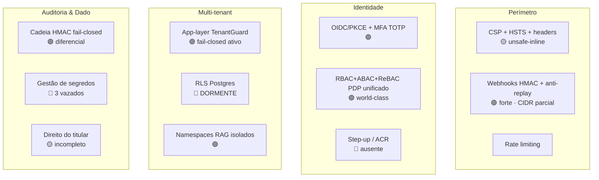

# Security Architecture (cross-cutting)

> **TOGAF — visão transversal de segurança.** Atravessa Business/Data/Application/Technology. Documenta os controles de segurança *como realmente estão no código* (não como o marketing descreve), separando o que é forte do que é aspiracional. Insumo do [Risk Register](risk-register.md) e da [ARS §1](../09-architecture-requirements-specification.md).

**Base de evidência:** leitura de código em `main` @ 2026-06-02 (ver [EVIDENCE-REGISTER](../EVIDENCE-REGISTER.md)). Toda afirmação é `path:linha`.

---

## 1. Modelo de defesa em camadas (estado real)

---

## 2. Controles FORTES (diferenciais reais)

### 2.1 Cadeia de auditoria HMAC — o diferencial nº 1
- **Como funciona:** ledger append-only; `hash = HMAC-SHA256(secret, previousHash | entityType | entityId | action | userId | createdAt | changesJson | organizationId)` — 8 campos, ordem fixa (`AuditHashChainComponent.java:230-249`). Genesis = 64 zeros. Cabeça da cadeia **por organização** (`audit_chain_head`).
- **Concorrência segura:** `pg_advisory_xact_lock(orgId)` + `SELECT ... FOR UPDATE` impedem fork da cadeia (`:119-135`). Transação única.
- **Captura inescapável:** Hibernate `Integrator` adiciona um listener a POST_INSERT/UPDATE/DELETE de **toda** entidade (`HibernateAuditIntegrator.java:22-24`). É a cadeia que o AGENTS.md §2.6 proíbe remover.
- **Fail-closed (verificado em 3 camadas):** prod bloqueia boot sem secret / sem HMAC; write lança sem `organization_id` (`:60-69, 270-271`). Espelho Node idêntico (`audit-interceptor.js:33-36, 353`).
- **Cross-process Java↔Node:** `@nuptechs/audit-chain` replica a ordem dos 8 campos byte-a-byte (`hmac.ts:33-43`); `CHAIN_VERSION = 3` pinado dos dois lados.
> **Veredito:** genuinamente forte e raro no mercado. Sustenta o pitch de auditoria para licitação.

### 2.2 Autorização tri-modelo (RBAC+ABAC+ReBAC) — world-class
- **PDP unificado** `POST /api/authorize` avalia as 3 camadas atomicamente, fail-closed, com `/batch` até 100 (`authorize.routes.ts:162-295`).
- **ReBAC Zanzibar genuíno:** tuplas `(obj)#relation@(subj)`, engine com check/expand/lookup, union/intersection/difference, cycle detection, `MAX_RECURSION_DEPTH=15`, fail-closed (`rebac-engine.ts:87-327`).
- **ABAC:** 16 operadores, regex com guarda ReDoS, limits stateful, obligations (`require_mfa/mask_field`), combining algorithms por sistema (`policy-evaluator.ts:30-125`).
> **Veredito:** supera Auth0+Permit.io combinados em superfície. O problema é **adoção** (ABAC 0/5 apps, ReBAC 1/5), não capacidade.

### 2.3 Webhooks endurecidos (ADR-050)
HMAC-SHA256 **constant-time** (`MessageDigest.isEqual`), anti-replay por janela, rate limit→429, body cap 1MiB→413, headers sensíveis redatados no audit (`WebhookInboundService.java:152-192`). **Limitação real:** allowlist é aproximação por octeto-prefixo, não CIDR completo (`:307`) — R9.

### 2.4 Isolamento de RAG por namespace
`legal-public` (compartilhado) · `legal-internal-<orgId>` (privado) · `guidelines-<orgId>` (ADR-045, isolado dos namespaces legais). Namespace validado (`schemas.js:12`). Provável o controle de isolamento mais limpo do parque.

---

## 3. Controles FRACOS / aspiracionais (a corrigir)

### 3.1 🔴 RLS multi-tenant é DORMENTE (não load-bearing)
A migration `0263` habilita RLS + policies nas 12 entidades de custom-field, **mas por ressalva da própria migration (`:24-47`):**
- RLS habilitado **sem `FORCE ROW LEVEL SECURITY`**.
- App conecta como **superuser/owner** no Railway → **RLS é silenciosamente bypassado**.
- Wiring `SET LOCAL app.current_organization_id` no Spring **não implementado** (conflito de ordem AOP).
→ **RLS oferece zero proteção em runtime hoje.** O isolamento multi-tenant repousa **inteiramente na camada de aplicação** (`TenantGuardComponent`), que tem **histórico de bugs cross-tenant** (ver §4). Esta é a maior distância entre "arquitetura-como-descrita" e "arquitetura-como-roda". **R2.**

### 3.2 🔴 Segredos versionados (3 confirmados)
- **R1 — crítico:** `Orbit/docker-compose.yml:28` tem **chave Anthropic viva** (`sk-ant-api03-CQrG...`) + `ENCRYPTION_KEY` (`:29`), versionada desde o commit inicial `672c51a`. Em histórico imutável → rotação + purge ambos necessários.
- **nup-aim/.replit** — `JWT_SECRET` hardcoded (128 hex) versionado.
- **NuP-School/docker-compose.yml:34** — `WEBHOOK_SECRET` real (64 hex) hardcoded; se reusado em prod, webhook forjável (R8).
> Resto do parque limpo: `.env` reais são gitignored (verificado `git check-ignore`).

### 3.3 🔴 Sem step-up / re-auth em ato de alto impacto
MFA é só no login (TOTP), não na transação. Glosa (ato financeiro), erasure LGPD, lançamento financeiro **não exigem re-auth**. Sem `acr`/`amr` no fluxo OIDC. **R7.**

### 3.4 🟡 Passkeys/WebAuthn são schema-only
Tabela `passkey_credentials` existe; **zero handlers/service**. ADR-0014 marca "✅" — incorreto. É placeholder.

### 3.5 🟡 CSP enfraquecido por `unsafe-inline`
Site nuptechs: bons headers (HSTS, nosniff, frame-options) mas CSP com `'unsafe-inline'` em `script-src` e `style-src` (`next.config.js:32-33`) — anula a proteção XSS. Aceitável para site estático; **não** se uma tela de app compartilhar essa config. **R10.**

### 3.6 🟡 Reuso de segredo audit↔LGPD
`AUDIT_HASH_SECRET` é reusado como salt de anonimização LGPD (`ExerciseDataSubjectRightServiceV1.java:65`). Compromisso de um quebra os dois. **R6.** Mais: o fallback `"easynup-dev-fallback-key-not-for-production"` é constante pública — **qualquer ambiente não-prod (hml) que rode com ele tem cadeia forjável**. Política: hml nunca pode conter dado de tenant de produção.

---

## 4. Histórico de incidentes (classe de bug recorrente)
Bugs cross-tenant reais, confirmados no código (corrigidos):
- `TenantGuardComponent` foi criado **"após auditoria forense identificar que 9 entidades de configuração não tinham organization_id e permitiam vazamento cross-org (violação LGPD)"** (`:28-31`).
- `CreateProjectServiceV1.java:108` documenta leak corrigido em `throwIfInactiveProjectExists` (checagem de unicidade cruzava tenant).
- O skip de 11 entidades no direito LGPD (R4) é o resíduo do mesmo problema de tenancy transitiva.
> **Conclusão:** vazamento cross-tenant é uma *classe de bug recorrente* aqui. Por isso REQ-SEC-03 (teste negativo em CI) é **Must**, e ativar RLS (R2) deixa de ser "defesa em profundidade" e vira **rede de segurança necessária**.

---

## 5. Postura de gestão de segredos
- Fonte: env vars no Railway (Java `@Value`, Node `@easynup/core/secrets` lazy). **Sem secret manager / Vault / rotação automatizada.**
- Aceitável para a escala atual, **exceto** pelos 3 segredos vazados. Recomendação: `gitleaks` pre-commit + CI (REQ-SEC-01), depois abstração de secret manager.

---

## 6. Roadmap de segurança (prioridade)

| Prioridade | Ação | REQ | Risco |
|---|---|---|---|
| **P0 (já)** | Rotacionar 3 segredos + purge histórico + gitleaks | REQ-SEC-01 | R1,R8 |
| **P1** | Ativar RLS (role não-superuser + FORCE + SET LOCAL) | REQ-SEC-02 | R2 |
| **P1** | Teste cross-tenant em CI como gate | REQ-SEC-03 | R3 |
| **P2** | Step-up MFA em atos de alto impacto | REQ-SEC-06 | R7 |
| **P2** | Separar salt LGPD do segredo de auditoria | REQ-SEC-05 | R6 |
| **P3** | CIDR completo em webhooks; CSP nonce-based | REQ-SEC-07 | R9,R10 |
| **P3** | ArchUnit garante listener de auditoria registrado | REQ-SEC-04 | R12 |
