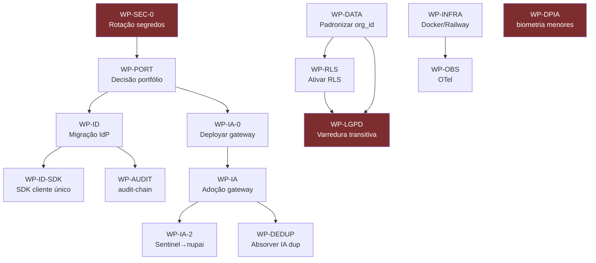

# Consolidated Gaps, Solutions & Dependencies Matrix

> **Artefato TOGAF — Phase E.** Consolida os gaps (baseline→target) de todas as fases, associa cada um a uma solução (work package), mapeia dependências entre work packages, e prioriza. É o insumo direto do [Implementation & Migration Plan](../06-opportunities-migration.md) e das [Transition Architectures](../phases/transition-architectures.md).

---

## 1. Matriz consolidada de gaps

Cada gap traz: severidade, fase de origem, solução (WP), e o risco associado no [Risk Register](../cross-cutting/risk-register.md).

| Gap | Descrição (corrigida pela evidência) | Sev. | Fase | Work Package | Risco |
|---|---|---|---|---|---|
| **G0** | Segredos versionados (Orbit chave Anthropic viva; nup-aim JWT; School webhook) | 🔴 P0 | D/Sec | **WP-SEC-0** Rotação + purge + gitleaks | R1, R8 |
| **G1** | IA fragmentada — 5 stacks LLM/RAG; gateway não-adotado | 🔴 | C/D | **WP-IA** Adoção do nupai-gateway | — |
| **G1b** | nupai-gateway **sem deploy de produção** (sem Dockerfile/railway) | 🔴 | D | **WP-IA-0** Endurecer+deployar gateway | — |
| **G1c** | nupai-gateway **desconectado do Sentinel** (Anthropic SDK direto) | 🟠 | App | **WP-IA-2** Sentinel→porta nupai-core | — |
| **G2** | Auth fora do IdP — Services/Chunks/Orbit/AIHub/Salon | 🟠 | A/Sec | **WP-ID** Migração ao NuPIdentify | — |
| **G2b** | **Sem SDK de cliente único** — 5 padrões de integração coexistem | 🟠 | App | **WP-ID-SDK** Adotar `@nuptechs/nupidentity-sdk` v2 (ADR-0014) | — |
| **G3** | Deploy disperso — 5 apps em Replit; Neon/Mongo | 🟠 | D | **WP-INFRA** Docker/Railway padrão | — |
| **G4** | Governança de dado — tenant key inconsistente; RAG/Pinecone disperso | 🟠 | C | **WP-DATA** Padronizar org_id + RAG no gateway | R2, R4 |
| **G4b** | **RLS dormente** (sem FORCE, superuser, SET LOCAL não wired) | 🔴 | C/Sec | **WP-RLS** Ativar RLS (role não-superuser + FORCE) | R2 |
| **G4c** | **Direito LGPD incompleto** — varre 1 de 12 entidades | 🔴 | C/Sec | **WP-LGPD** Varredura transitiva via FK | R4 |
| **G5** | Portfólio sem racionalização — satélites estagnados | 🟡 | B | **WP-PORT** Decisão consolidar/arquivar | — |
| **G6** | Auditoria não-uniforme — HMAC só easynup/Sentinel | 🟡 | Sec | **WP-AUDIT** `@nuptechs/audit-chain` no parque | R6 |
| **G7** | Observabilidade parcial | 🟡 | D | **WP-OBS** Stack OTel padrão | — |
| **G8** | Capacidade IA duplicada (FPA/RAG/Document-AI em 3-4 apps) | 🟡 | App | **WP-DEDUP** Absorver no gateway/easynup | — |
| **G9** | **Self-healing não fecha** (sem LocalTestRunner; verify=LLM) | 🟠 | App | **WP-SELFHEAL** Loop teste-real (ADR-044 Onda 2) | — |
| **G10** | **Compliance 14.133 só no easynup** (Sentinel faz LGPD/SOC2) | 🟡 | B | **WP-COMP** Extrair pacote de compliance gov BR | — |
| **G11** | **Sem step-up** em ato de alto impacto (glosa, erasure) | 🟠 | Sec | **WP-STEPUP** ACR/step-up MFA | R7 |
| **G12** | **Biometria de menores sem DPIA** (NuP-School) | 🔴 | Priv | **WP-DPIA** RIPD + consentimento responsável | R5 |
| **G13** | Drift de versão consumidor↔plataforma (Sales na 0.1.x) | 🟡 | App | **WP-VER** Renovate/bump automatizado | — |

---

## 2. Grafo de dependências entre work packages

**Caminhos críticos:**
- **Segurança/privacidade (independente, urgente):** WP-SEC-0, WP-DPIA, WP-RLS→WP-LGPD podem (e devem) iniciar já — não dependem da consolidação.
- **IA:** WP-PORT → WP-IA-0 (deployar gateway) → WP-IA (adoção) → WP-IA-2 + WP-DEDUP. O gateway **precisa de deploy antes** de qualquer migração de consumidor.
- **Identidade:** WP-PORT → WP-ID → WP-ID-SDK.

---

## 3. Priorização (severidade × dependência × esforço)

| Onda | Work packages | Justificativa |
|---|---|---|
| **0 — Higiene (já)** | WP-SEC-0, WP-DPIA, WP-PORT | Risco P0/regulatório, independem de tudo |
| **1 — Fundação segura** | WP-RLS → WP-LGPD, WP-ID | Fecha isolamento + direito LGPD + identidade |
| **2 — IA unificada** | WP-IA-0 → WP-IA → WP-IA-2/WP-DEDUP | Maior dívida estrutural; gateway primeiro |
| **3 — Endurecimento** | WP-INFRA→WP-OBS, WP-AUDIT, WP-ID-SDK, WP-STEPUP, WP-SELFHEAL, WP-VER, WP-COMP | Uniformidade operacional e produto |

Detalhe de sequenciamento temporal nas [Transition Architectures](../phases/transition-architectures.md).

---

## 4. Dependências externas (fora do controle de arquitetura)

| Dependência | Bloqueia | Mitigação |
|---|---|---|
| DBA para role Postgres não-superuser | WP-RLS | Plano de 5 passos documentado; pode ser feito por Yuri |
| Decisão de produto (arquivar satélites) | WP-PORT | Reunião de governança (1 sessão) |
| Maturação do gateway (itens "planned": BAML, recipe loader) | WP-IA | Endurecer em WP-IA-0 antes de migrar |
| Rotação de chave Anthropic (conta) | WP-SEC-0 | Ação operacional imediata de Yuri |
