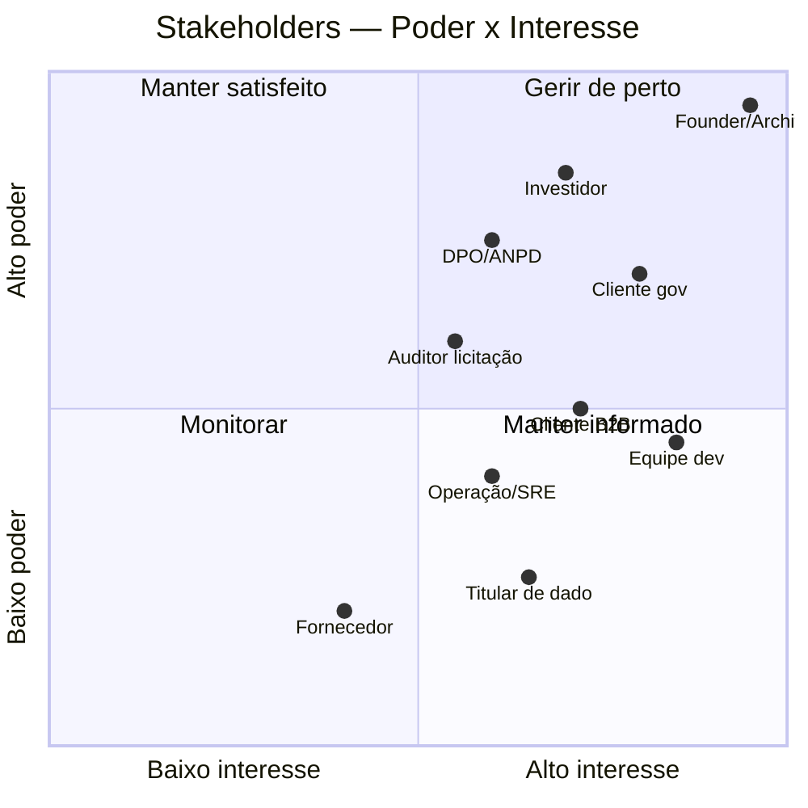

# Stakeholder Map Matrix + Communications Plan

> **Artefato TOGAF — Phase A.** Identifica stakeholders, classifica por poder/interesse, mapeia suas *concerns* às *views* da EA que as endereçam, e define o plano de comunicação. É o que garante que a arquitetura responde a quem importa.

---

## 1. Catálogo de Stakeholders

| ID | Stakeholder | Tipo | Papel na arquitetura |
|---|---|---|---|
| STK-01 | **Founder / Lead Architect** (Yuri F.) | Interno | Patrocinador, Architecture Owner, aprova ADRs e ondas |
| STK-02 | **Investidor / Board** | Externo | Avalia se NuPTechs é plataforma defensável; financia |
| STK-03 | **Cliente setor público** (órgão, gestor de contrato) | Externo | Usuário do easynup; exige conformidade Lei 14.133 + auditoria + on-prem |
| STK-04 | **DPO / Encarregado LGPD / ANPD** | Externo/regulatório | Exige rastreabilidade de dado pessoal, atende direito do titular |
| STK-05 | **Cliente B2B** (escola, varejo, salão) | Externo | Usuário de School/Sales/Salon; exige confiabilidade, SSO, pagamentos |
| STK-06 | **Usuário final / titular de dado** (aluno/responsável, comprador) | Externo | Dono do dado pessoal; menores no NuP-School (proteção reforçada) |
| STK-07 | **Equipe de desenvolvimento / sessões IA** | Interno | Constrói sobre a plataforma; precisa de padrões claros e reuso |
| STK-08 | **Auditor / fiscal de licitação** | Externo | Verifica trilha tamper-proof, conformidade de processo |
| STK-09 | **Operação / SRE** | Interno | Deploy, observabilidade, resposta a incidente |
| STK-10 | **Fornecedor (Vendor) / contraparte de contrato** | Externo | Sujeito a glosa/aceite; dado tratado pelo easynup |

---

## 2. Matriz Poder × Interesse (priorização de engajamento)

---

## 3. Matriz Stakeholder × Concern × View (CRUD de preocupações)

Liga cada concern à(s) view(s) da EA que a endereça — garante cobertura.

| Stakeholder | Concern principal | View(s) que endereça |
|---|---|---|
| STK-01 Founder | Reduzir custo de manter 24 repos; foco; bus-factor | Fase E/F (consolidação), EVIDENCE-REGISTER, ADRs |
| STK-02 Investidor | É plataforma defensável ou side-projects? | Fase A (4 pilares), Fase B (capacidades), [viewer](../viewer/) |
| STK-03 Cliente gov | Conformidade 14.133, auditoria, on-prem, LGPD | [Security Arch](../cross-cutting/security-architecture.md), [Privacy/LGPD](../cross-cutting/privacy-lgpd-architecture.md), Fase D |
| STK-04 DPO/ANPD | Direito do titular, ROPA, retenção, dado sensível | [Privacy/LGPD](../cross-cutting/privacy-lgpd-architecture.md), [Risk Register](../cross-cutting/risk-register.md) R4/R5 |
| STK-05 Cliente B2B | SSO, pagamentos, confiabilidade | Pilares P1/P2, Fase C (Application) |
| STK-06 Titular de dado | Meu dado está protegido? (menor!) | [Privacy/LGPD](../cross-cutting/privacy-lgpd-architecture.md) DPIA, R5 |
| STK-07 Equipe dev | Padrões claros, reuso, não duplicar | [Principles Catalog](principles-catalog.md), [technology-standards](technology-standards.md), Fase D |
| STK-08 Auditor | Trilha tamper-proof, conformidade de processo | [Security Arch](../cross-cutting/security-architecture.md) §HMAC, Fase G governança |
| STK-09 Operação/SRE | Deploy reprodutível, observabilidade, rollback | Fase D §infra, [Risk Register](../cross-cutting/risk-register.md) |
| STK-10 Fornecedor | Glosa/aceite justos e fundamentados | Fase B (value stream), ADR-049 (apoio à decisão) |

> Toda concern tem ao menos uma view. Concerns de maior poder×interesse (Founder, Investidor, Cliente gov, DPO) têm views dedicadas e aprofundadas.

---

## 4. Communications Plan

| Audiência | Artefato/canal | Formato | Cadência |
|---|---|---|---|
| **Investidor** | [Dashboard navegável](../viewer/) (`/arquitetura`) + Fase A + deck de PNGs LikeC4 | Visual, executivo | Sob demanda (pitch) |
| **Founder/Architect** | EA completa + EVIDENCE-REGISTER + Risk Register | Markdown técnico | Revisão por onda concluída |
| **Cliente gov / auditor** | Security Architecture + Privacy/LGPD + conformidade 14.133 | Documento formal + evidência path:linha | Por engajamento comercial |
| **DPO/ANPD** | ROPA + DPIA + runbook de direito do titular | Documento de conformidade | Anual + por solicitação ANPD |
| **Equipe dev** | Principles + Standards + ADRs + likec4 MCP | as-code + MCP para IA | Contínuo (no fluxo de PR) |
| **Operação** | Fase D infra + Risk Register + runbooks | Operacional | Por mudança de infra |

### Princípios de comunicação
1. **Investidor vê o "navegável", não o markdown** — o dashboard `/arquitetura` é a interface de pitch; os 4 pilares são a mensagem.
2. **Auditor/DPO recebem evidência citável** (`path:linha`) — credibilidade vem de rastreabilidade, não de afirmação.
3. **Dev consome a EA como código** — likec4 + MCP deixam a arquitetura disponível para agentes de IA no fluxo de trabalho.
4. **Toda comunicação externa de conformidade passa pela checagem de frescura** (EVIDENCE-REGISTER) — nunca citar doc obsoleto a um regulador.
