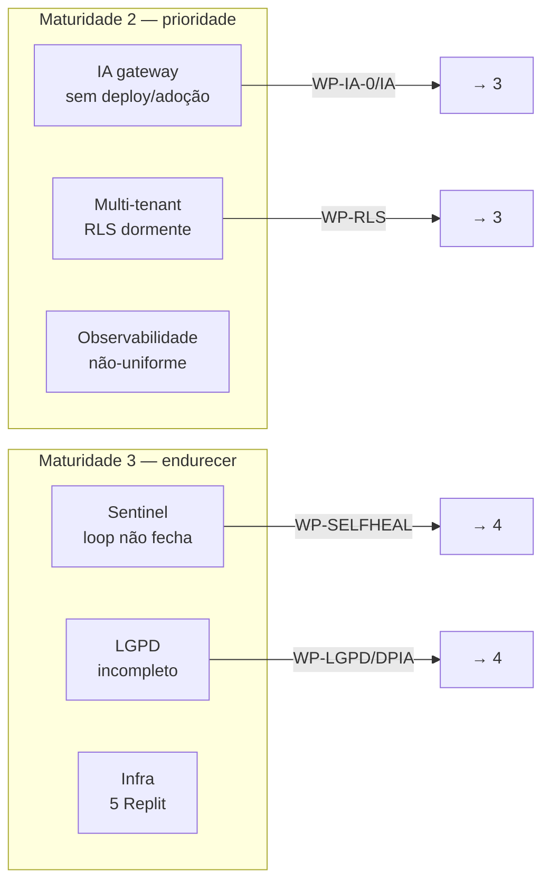

# Capability Assessment & Architecture Maturity

> **TOGAF — Business Transformation Readiness Assessment + Architecture Capability Maturity.** Avalia (1) a maturidade de cada capacidade da plataforma, (2) a prontidão da organização para a transformação proposta, e (3) a maturidade da própria função de arquitetura. Responde "estamos prontos para executar o roadmap?".

---

## 1. Maturidade das capacidades de plataforma (escala CMM 1–5)

Escala: **1** Inicial · **2** Gerenciado · **3** Definido · **4** Medido · **5** Otimizado.

| Capacidade | Maturidade | Evidência | Lacuna p/ nível seguinte |
|---|---|---|---|
| **Identidade (NuPIdentify)** | **4 — Medido** | OIDC/PAR/DPoP, RBAC+ABAC+ReBAC, 108 testes, mutation testing | Adoção uniforme + SDK único → 5 |
| **Autorização** | **4** | PDP unificado fail-closed, Zanzibar genuíno | ABAC/ReBAC adotados além de 0-1/5 apps |
| **Pagamentos/Billing** | **4** | outbox+idempotência, multi-PSP, 4 consumidores, billing-school 2.0 | Rotear 100% pela porta (sem Stripe direto) |
| **Auditoria HMAC** | **4** | fail-closed 3 camadas, cross-process v3 | Uniformizar no parque + ArchUnit → 5 |
| **IA (nupai-gateway)** | **2 — Gerenciado** | 17 portas, adapters reais, recipes RRF | **Sem deploy + adoção zero** → precisa 3 |
| **Qualidade (Sentinel)** | **3 — Definido** | detectores reais, MCP, open-PR, SARIF | **Loop self-healing não fecha** (sem LocalTestRunner) |
| **Multi-tenant** | **2** | app-layer fail-closed ativa | **RLS dormente** + bug recorrente → 3 |
| **Privacidade/LGPD** | **3** | direitos, anonimização, retenção, trilha | **Varredura incompleta + DPIA ausente** |
| **Pacotes compartilhados** | **3** | DAG limpo, tsup dual, Changesets | Drift de versão consumidores; conference/messaging 0.1.0 |
| **Observabilidade** | **2** | OTel em easynup/Identify | Não-uniforme → padrão no parque |
| **Deploy/Infra** | **3** | Railway+Docker padrão, NuPIdentify portável | 5 em Replit; gateway sem deploy |

**Maturidade média ponderada da plataforma: ~3.0 (Definido)** — fundação madura, com dois pontos baixos críticos (IA=2 por falta de deploy, Multi-tenant=2 por RLS dormente) que o roadmap eleva.

---

## 2. Maturidade da função de Arquitetura (TOGAF ACMM)

| Dimensão ACMM | Nível | Evidência |
|---|---|---|
| **Architecture process** | 4 | ADM aplicado; ADRs disciplinados (easynup 42, platform 8) |
| **Architecture development** | 4 | Esta EA + likec4 as-code + evidência citável |
| **Business linkage** | 3 | Drivers→princípios→requisitos rastreados; falta validação formal com "board" |
| **Senior management involvement** | 3 | Founder é patrocinador+arquiteto (força e risco — bus-factor) |
| **Operating unit participation** | 2 | Solo + sessões IA; sem múltiplas unidades |
| **Architecture communication** | 4 | Dashboard navegável, MCP, Diátaxis |
| **IT security / governance** | 3 | Princípios + Risk Register + governança Fase G; gaps de execução (RLS, segredos) |
| **Governance** | 3 | EVIDENCE-REGISTER + ADRs corporativos propostos |

> A função de arquitetura é **madura para o tamanho da organização** (founder+IA). O maior risco organizacional é o **bus-factor de 1** — mitigado justamente por esta EA + ADRs (conhecimento tácito → explícito), que é parte do valor para due diligence de investidor.

---

## 3. Business Transformation Readiness Assessment (BTRA)

Avaliação dos fatores de prontidão para executar o roadmap (TOGAF: cada fator → estado, risco, ação).

| Fator de prontidão | Estado | Risco | Ação |
|---|---|---|---|
| **Visão clara** | 🟢 Forte | Baixo | Tese dos 4 pilares cravada (Fase A) |
| **Desejo/motivação** | 🟢 Forte | Baixo | Drivers consolidação+pitch explícitos |
| **Patrocínio** | 🟡 Concentrado | **Médio (bus-factor)** | EA+ADRs codificam conhecimento |
| **Capacidade de execução** | 🟡 Solo+IA | Médio | Ondas incrementais; cada uma entrega valor isolado |
| **Capacidade de financiar** | 🟡 Depende de pitch | Médio | A própria EA sustenta o pitch |
| **Governança/processo** | 🟢 Maduro | Baixo | ADM + ADR + worktree/PR disciplinado |
| **Prontidão técnica** | 🟢 Alta | Baixo | Cultura hexagonal; pilares existem |
| **Risco de paralisia por consolidação** | 🟡 | Médio | Transition Architectures (T0-T3) com valor por marco |

**Veredito de prontidão:** **PRONTO para iniciar**, com a ressalva de que a execução é solo — daí a importância de (a) ondas pequenas com valor por marco, e (b) começar pelos itens *independentes e urgentes* (T0: segredos, DPIA) que não dependem de capacidade de execução em escala.

---

## 4. Gap de maturidade — onde investir

**Os dois investimentos de maior alavancagem** (sobem capacidade de 2→3 e destravam o pitch):
1. **Deployar e adotar o nupai-gateway** (IA: 2→3+) — converte um ativo construído-mas-ocioso em pilar real.
2. **Ativar RLS + completar tenancy** (Multi-tenant: 2→3) — transforma "defesa em profundidade anunciada" em real, e fecha a tríade R2/R3/R4.

---

## 5. Conclusão

A NuPTechs tem **maturidade de plataforma média-alta (~3) com dois pontos baixos bem localizados** e uma **função de arquitetura madura para seu porte**. A organização está **pronta para executar** o roadmap, desde que respeite o sequenciamento das Transition Architectures (valor por marco) e ataque primeiro os itens urgentes-independentes (T0). O principal risco não é técnico — é o **bus-factor**, que esta própria EA mitiga ao tornar explícito o conhecimento que sustentaria uma due diligence.
