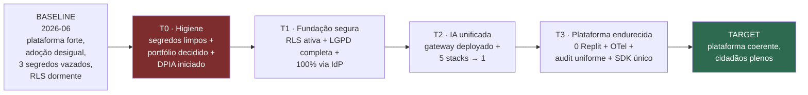

# Transition Architectures

> **TOGAF — Phase E/F.** Define os **estados intermediários estáveis** entre a arquitetura baseline (hoje) e a target (alvo). Cada Transition Architecture (T1–T3) é um marco *deployável e que entrega valor sozinho* — não um passo intermediário quebrado. Operacionaliza o [roadmap de ondas](../06-opportunities-migration.md) com os [work packages](../matrices/consolidated-gaps-solutions-dependencies.md).

---

## 1. Visão geral da progressão

Cada transição tem: **objetivo · escopo · critério de saída (mensurável) · valor entregue · riscos fechados.**

---

## 2. T0 — Higiene e Decisão *(estado de partida, sem dependências)*

- **Objetivo:** eliminar risco P0 e travar o escopo antes de investir em migração.
- **Escopo (WPs):** WP-SEC-0 (rotação de 3 segredos + purge + gitleaks), WP-DPIA (RIPD biometria menores), WP-PORT (decisão consolidar/arquivar por repo).
- **Critério de saída:**
  - `gitleaks` em CI = 0 findings; chave Anthropic Orbit + JWT aim + webhook School rotacionados.
  - DPIA-1 (NuP-School biometria) iniciado/aprovado.
  - Planilha de decisão de portfólio assinada (cada um dos 24 repos classificado).
- **Valor entregue:** parque sem segredo exposto; risco regulatório de menores endereçado; foco definido.
- **Riscos fechados:** R1, R5 (iniciado), R-EXTRA.

## 3. T1 — Fundação Segura

- **Objetivo:** tornar o isolamento multi-tenant e a identidade *load-bearing* e completos.
- **Escopo (WPs):** WP-RLS (ativar RLS) → WP-LGPD (varredura transitiva completa), WP-ID (migrar Services/Chunks/Orbit/AIHub/Salon ao IdP).
- **Pré-condição:** T0 (não migrar o que será arquivado).
- **Critério de saída:**
  - RLS com `FORCE` + role não-superuser; teste cross-tenant em CI falha sem `org_id` (REQ-SEC-02/03).
  - `exerciseDataSubjectRight.v1` varre as 12 entidades (REQ-PRIV-01).
  - 100% dos produtos ativos autenticam via NuPIdentify (REQ-ID-01); 0 auth própria nova.
- **Valor entregue:** vendável a cliente gov/DPO com isolamento *real* e direito do titular *completo*; SSO unificado.
- **Riscos fechados:** R2, R3, R4, R8.

## 4. T2 — IA Unificada

- **Objetivo:** toda IA por um gateway único, deployável e governado.
- **Escopo (WPs):** WP-IA-0 (Dockerfile+railway+endurecer gateway; fechar itens "planned": BAML, recipe loader) → WP-IA (migrar easynup/study/aim/AIHub/Chunks ao gateway) → WP-IA-2 (Sentinel→porta nupai-core) + WP-DEDUP (absorver FPA/RAG duplicados).
- **Pré-condição:** T0 (portfólio); gateway endurecido **antes** de migrar consumidores (piloto valida latência/custo/qualidade byte-a-byte vs baseline).
- **Critério de saída:**
  - Gateway com deploy de produção on-prem-capaz (REQ-IA-02).
  - 0 stacks LLM paralelos; custo de IA observável num ponto (REQ-IA-01); RAG isolado por tenant no gateway (REQ-IA-03).
  - Sentinel usa a porta LLM do nupai-core (não Anthropic SDK direto).
- **Valor entregue:** governança de custo/guardrail/observabilidade de IA; troca de provider sem refactor; on-prem de IA viável (pitch gov).
- **Riscos fechados:** — (estrutural; reduz superfície de manutenção).

## 5. T3 — Plataforma Endurecida

- **Objetivo:** uniformidade operacional e fechamento dos gaps de produto.
- **Escopo (WPs):** WP-INFRA (sair de Replit/Neon/Mongo → Docker/Railway) → WP-OBS (OTel padrão), WP-AUDIT (`@nuptechs/audit-chain` no parque), WP-ID-SDK (SDK cliente único v2), WP-STEPUP (step-up MFA), WP-SELFHEAL (loop de teste real — ADR-044 Onda 2), WP-VER (bump automatizado), WP-COMP (avaliar pacote compliance gov BR).
- **Pré-condição:** T1, T2.
- **Critério de saída:**
  - 0 serviços de produção em Replit (REQ-TECH-01); OTel nos produtos core (REQ-TECH-02).
  - 1 cadeia de auditoria uniforme; SDK de cliente único adotado.
  - Step-up em atos de alto impacto (REQ-SEC-06).
- **Valor entregue:** operação reprodutível e observável; bus-factor reduzido (SDK/padrões); produto de qualidade (Sentinel) com loop fechado.
- **Riscos fechados:** R6, R7, R11, R12.

---

## 6. Tabela-resumo das transições

| Transição | Tema | WPs | KPI de saída | Riscos fechados |
|---|---|---|---|---|
| **T0** | Higiene | SEC-0, DPIA, PORT | 0 segredos; DPIA iniciado; portfólio decidido | R1,R5,R-EXTRA |
| **T1** | Fundação segura | RLS→LGPD, ID | RLS ativa; titular completo; 100% IdP | R2,R3,R4,R8 |
| **T2** | IA unificada | IA-0→IA→IA-2/DEDUP | gateway deployado; 0 stacks paralelos | (estrutural) |
| **T3** | Endurecimento | INFRA→OBS, AUDIT, ID-SDK, STEPUP, SELFHEAL | 0 Replit; OTel; audit uniforme | R6,R7,R11,R12 |

---

## 7. Estado de capacidade por transição (a "barra" subindo)

| Capacidade | Baseline | T0 | T1 | T2 | T3 / Target |
|---|---|---|---|---|---|
| Segredos | 🔴 3 vazados | 🟢 limpos | 🟢 | 🟢 | 🟢 + manager |
| Multi-tenant | 🟡 só app | 🟡 | 🟢 RLS ativa | 🟢 | 🟢 |
| Direito LGPD | 🔴 1/12 | 🔴 | 🟢 12/12 | 🟢 | 🟢 |
| Identidade | 🟡 ~70% | 🟡 | 🟢 100% | 🟢 | 🟢 + SDK único |
| IA governada | 🔴 5 stacks | 🔴 | 🔴 | 🟢 1 gateway | 🟢 |
| Deploy/infra | 🟡 5 Replit | 🟡 | 🟡 | 🟡 | 🟢 0 Replit |
| Auditoria | 🟢 easynup | 🟢 | 🟢 | 🟢 | 🟢 uniforme |
| Self-healing | 🟡 sem loop | 🟡 | 🟡 | 🟡 | 🟢 loop fechado |

> Cada transição é um **ponto de parada estável** — se o roadmap pausar em T1, a NuPTechs já está materialmente mais segura e vendável que no baseline. Isso é o que diferencia Transition Architectures de "fases de um big-bang".
