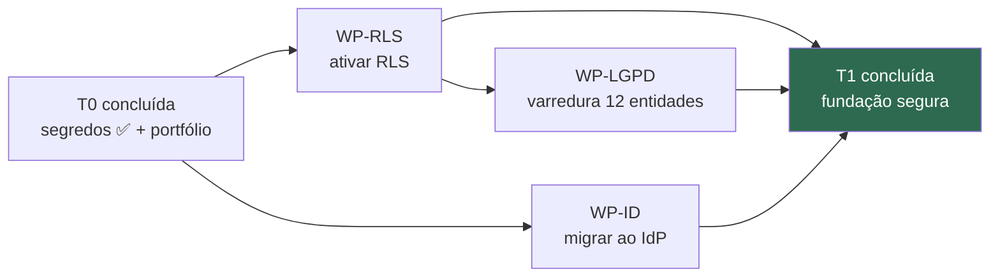

# Plano de Execução — Onda T1 (Fundação Segura)

> **TOGAF — Implementation & Migration Plan (detalhe de uma transição).** Plano executável da [Transition Architecture T1](transition-architectures.md): tornar o isolamento multi-tenant e o direito do titular *load-bearing* e completos, e a identidade 100%. Cada work package tem passos concretos, ordem, critério de aceite e dono.

**Pré-condição:** T0 (higiene) concluída — segredos remediados ✅ (Orbit/nup-aim/School), portfólio decidido. **Não migrar** o que será arquivado.
**Riscos fechados por T1:** R2 (RLS dormente), R3 (bug cross-tenant recorrente), R4 (LGPD incompleto), R8 (webhook School).

---

## 1. WP-RLS — Ativar Row-Level Security (fecha R2)

**Objetivo:** RLS Postgres passa de *provisionado-dormente* a *enforcing*. Hoje a migration `0263` habilitou RLS sem `FORCE`, e o app conecta como superuser → bypass silencioso ([security-arch §3.1](../cross-cutting/security-architecture.md)).

### Passos (plano DBA de 5 etapas)
1. **Criar role de aplicação não-superuser** no Postgres:
   ```sql
   CREATE ROLE easynup_app LOGIN PASSWORD '<via secret>' NOBYPASSRLS;
   GRANT CONNECT ON DATABASE easynup TO easynup_app;
   GRANT USAGE ON SCHEMA public TO easynup_app;
   GRANT SELECT, INSERT, UPDATE, DELETE ON ALL TABLES IN SCHEMA public TO easynup_app;
   ALTER DEFAULT PRIVILEGES IN SCHEMA public GRANT SELECT,INSERT,UPDATE,DELETE ON TABLES TO easynup_app;
   ```
2. **Adicionar `FORCE ROW LEVEL SECURITY`** nas 12 entidades já com RLS (migration nova `0266_*`):
   ```sql
   ALTER TABLE contract FORCE ROW LEVEL SECURITY;  -- + as outras 11
   ```
   (necessário porque sem FORCE o *owner* da tabela ignora RLS.)
3. **Wire `SET LOCAL` no transaction manager** — definir `app.current_organization_id` por transação a partir do JWT. Resolver o conflito de ordem AOP que travou isto (interceptor que roda *após* o begin da transação e *antes* de qualquer query): implementar um `TenantAwareJpaTransactionManager` ou um `@PostConstruct` no início da transação que faça `SET LOCAL app.current_organization_id = :orgId`.
4. **Trocar o `DATABASE_URL` de produção** para conectar como `easynup_app` (não o owner/superuser).
5. **Smoke + rollback plan:** validar que queries sem `org_id` setado retornam vazio (não erro); manter o role antigo disponível para rollback imediato.

### Critério de aceite (REQ-SEC-02/03)
- [ ] App conecta como role `NOBYPASSRLS`.
- [ ] `FORCE RLS` nas 12 tabelas.
- [ ] Teste de integração: query sem `app.current_organization_id` → 0 linhas; com org A → só dados de A.
- [ ] Teste negativo cross-tenant em CI como **gate** por Spec nova.

### Dono / risco
DBA (Yuri). Risco de execução: queries de background/jobs sem `org_id` (a função `app_current_org_id()` já retorna NULL nesse caso — garantir que jobs usem um caminho explícito).

---

## 2. WP-LGPD — Direito do titular completo (fecha R4)

**Objetivo:** `exerciseDataSubjectRight.v1` varre as **12 entidades**, não só `contract`. Hoje pula as 11 transitivas (FK→contract) para evitar leak ([privacy §3](../cross-cutting/privacy-lgpd-architecture.md)).

### Decisão de design (escolher 1)
- **Opção A (recomendada, alinha com WP-RLS):** denormalizar `organization_id` direto nas 11 entidades transitivas (migration + backfill via JOIN com contract). Simplifica RLS *e* a varredura LGPD. É o padrão-alvo (ADR-EA-005).
- **Opção B (interino):** varredura transitiva via `EXISTS (SELECT 1 FROM contract c WHERE c.id = t.contract_id AND c.organization_id = :org)` — sem mudança de schema, mais lento.

### Passos (Opção A)
1. Migration `0267_*`: adicionar `organization_id` (nullable temp) nas 11 entidades + backfill `UPDATE t SET organization_id = c.organization_id FROM contract c WHERE t.contract_id = c.id`.
2. Tornar `organization_id` NOT NULL após backfill; adicionar à RLS (WP-RLS).
3. Atualizar `ExerciseDataSubjectRightServiceV1` para iterar as 12 entidades (remover o skip de `:174-180`).
4. Atualizar `DataRetentionPolicy` para as novas colunas.

### Critério de aceite (REQ-PRIV-01)
- [ ] ACCESS/EXPORT/ERASURE/ANONYMIZATION retornam linhas das 12 entidades.
- [ ] Teste: titular com dado em `service_order`/`timesheet` é encontrado (hoje retorna 0).
- [ ] Trilha `LGPD_RIGHT_EXERCISED` na cadeia HMAC mantém-se.

### Dono / dependência
Backend (Yuri + sessão IA). Depende de WP-RLS (mesma denormalização).

---

## 3. WP-ID — Identidade 100% via NuPIdentify (ADR-EA-001)

**Objetivo:** os produtos marcados "consolidar/reposicionar" migram de auth própria para OIDC. (Services/Chunks/AIHub se arquivados, pulam.)

### Passos por produto (Salon, + os que sobreviverem à decisão de portfólio)
1. Registrar OAuth client no NuPIdentify (`register-<produto>-client.ts`), tipo conforme (PKCE público p/ web/mobile).
2. Gerar `permissions.json` + sync no startup (`IdentitySyncService`).
3. Trocar a auth local pelo `@nuptechs/nupidentity-sdk` (mantendo `DevBypass` só em dev).
4. Migrar usuários existentes (mapear contas locais → identidades do IdP) ou cadastro novo.

### Critério de aceite (REQ-ID-01/03)
- [ ] `[IdentitySync] Sync OK` no boot de cada produto migrado.
- [ ] 0 auth própria nova; login via OIDC.
- [ ] (Onde aplicável) ReBAC/ABAC plugados via SDK.

### Dono / nota
Por produto (Yuri + sessão IA). **Salon** é o caso mais direto (já usa pacotes da plataforma, só falta auth). Os satélites dependem da decisão de portfólio (T0).

---

## 4. Sequência e dependências



- **WP-RLS e WP-ID são paralelos** (independentes).
- **WP-LGPD depende de WP-RLS** (compartilham a denormalização de `org_id`).

---

## 5. Definição de "T1 concluída" (gate para T2)

| Critério | REQ | Verificação |
|---|---|---|
| RLS enforcing (role NOBYPASSRLS + FORCE + SET LOCAL) | REQ-SEC-02 | teste cross-tenant em CI |
| Teste negativo cross-tenant como gate | REQ-SEC-03 | CI |
| Direito do titular varre 12 entidades | REQ-PRIV-01 | teste de titular em entidade transitiva |
| 100% dos produtos ativos via NuPIdentify | REQ-ID-01 | `[IdentitySync] Sync OK` em todos |
| Webhook secret School rotacionado em prod | R8 | env de prod ≠ default dev |

> Só após T1 concluída inicia-se T2 (IA unificada) — e a multi-tenancy celular da [Fábrica de Software §5](../target-at-scale/software-factory-target.md) passa a ser viável (RLS é seu pré-requisito).

---

## 6. Estimativa honesta
Conservadora (lição i18n: multiplicar estimativas de cleanup massivo). WP-RLS é o mais delicado (toca produção + DBA + ordem AOP). WP-LGPD é mecânico mas amplo (migration + backfill + 11 entidades). WP-ID é por produto. **Não cabe numa sessão** — fatiar em PRs: (1) migration de denormalização, (2) FORCE RLS + role, (3) SET LOCAL wiring, (4) varredura LGPD, (5..n) migração de cada produto ao IdP.
