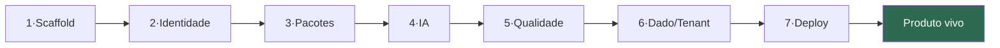

# Golden Path — `nup new-product` (spec implementável)

> **Spec da linha de montagem da Fábrica de Software** ([ADR-EA-006](../adr/ADR-EA-006-fabrica-de-software.md)). Define, de forma implementável, o golden path que transforma uma ideia de produto vertical num SaaS multi-tenant **conforme e monetizável** em < 1 dia, plugando os 4 pilares automaticamente. Cada etapa **compõe peças que já existem** — o golden path costura, não reinventa.

**Princípio:** caminho opinativo (o fácil é o conforme) **com escape hatch** (desvio é possível, mas explícito via ADR). Implementação-alvo: comando do `@nuptechs/nup-suite` (que já faz bootstrap de Sentinel/Probe/Manifest).

> ⚠️ **Gate de industrialização (ADR-EA-006):** este golden path só é construído **após T1–T3**. Antes, é a especificação-alvo — o "norte" que padroniza o que já se repete no fluxo artesanal atual.

---

## 1. Interface de comando

```bash
nup new-product <slug> \
  --display "Gestão de Clínicas" \
  --segment health \
  --features billing,messaging,ai-rag \
  --tier-model free,pro,enterprise \
  [--pii sensitive]        # dispara checklist LGPD reforçado (DPIA)
  [--no-<feature>]         # escape hatch: opta por não plugar um pilar
```

Saída: um repositório novo `nup-<slug>` pronto, registrado no IdP, com CI verde e deploy de HML no ar.

---

## 2. As 7 estações da linha de montagem

Cada estação tem: **o que faz · peça existente que reusa · artefato gerado · gate de conformidade.**



### Estação 1 — Scaffold hexagonal
- **Faz:** cria a estrutura `domain/ application/{ports,use-cases} adapters/{in,out}` + `Dockerfile` + CI + `.env.example` + testes base.
- **Reusa:** templates do `nup-suite`; padrão hexagonal já presente em Sales/Orbit/gateway.
- **Gera:** repo `nup-<slug>` com `package.json`, `turbo.json`, `tsconfig`.
- **Gate:** `npx tsc --noEmit` + lint verdes (REQ-PLAT-01).

### Estação 2 — Identidade (ADR-EA-001)
- **Faz:** registra um OAuth client no NuPIdentify; gera `permissions.json` inicial a partir das features; configura OIDC/PKCE + sync no startup.
- **Reusa:** `register-*-client.ts` + `@nuptechs/nupidentity-sdk` (SDK único, ADR-EA-001); `IdentitySyncService`.
- **Gera:** `permissions.json`, env `NUPIDENTITY_*`, middleware de auth, `DevBypass` para dev.
- **Gate:** `[IdentitySync] Sync OK` no boot; 0 auth própria.

### Estação 3 — Pacotes de plataforma (ADR-EA-002 reuso)
- **Faz:** pluga os `@nuptechs/*` conforme `--features` (billing→`billing`+`payments-core`; messaging→`messaging-*`; voice→`voice-agent-*`).
- **Reusa:** monorepo `nup-platform` (GitHub Packages); padrão de NuP-School (13 pacotes).
- **Gera:** deps no `package.json` (versão = última publicada, não defasada — REQ-PLAT-03); wiring via portas.
- **Gate:** pagamento via porta `payments-core`, nunca `new Stripe()` direto (REQ-PLAT-02).

### Estação 4 — IA via gateway (ADR-EA-002)
- **Faz:** se `ai-rag` em features, cria uma **recipe** de RAG do domínio no nupai-gateway + provisiona namespace de tenant; aponta o app para o gateway (não SDK direto).
- **Reusa:** `nupai-gateway` (recipes versionadas, hybrid-search RRF); namespace isolado por tenant.
- **Gera:** `recipe: <slug>-rag@1.0`, env `NUPAI_GATEWAY_URL` + API key do projeto.
- **Gate:** 0 imports de `@anthropic-ai/sdk`/`openai` no produto (REQ-IA-01).

### Estação 5 — Qualidade & Auditoria (ADR-EA-004)
- **Faz:** registra o repo no Sentinel (codelens-emit + ingest); pluga `@nuptechs/audit-chain` (se trata dado sensível); liga o quality gate no CI.
- **Reusa:** Sentinel (Finding v2, quality gate); `@nuptechs/audit-chain` (CHAIN_VERSION 3).
- **Gera:** workflow `sentinel-emit.yml`, wiring de audit, `AUDIT_HASH_SECRET` (env, separado do salt LGPD).
- **Gate:** Sentinel quality gate ativo; cadeia HMAC `/verify-integrity` 🟢.

### Estação 6 — Dado & Tenant (ADR-EA-005)
- **Faz:** schema com `organization_id` **direto** em toda entidade; RLS habilitado com `FORCE`; conexão via role não-superuser; teste cross-tenant no CI. Se `--pii sensitive`, dispara checklist LGPD/DPIA.
- **Reusa:** padrão de tenant key (ADR-EA-005); `exerciseDataSubjectRight` (se PII); `DataRetentionPolicy`.
- **Gera:** schema Drizzle/JPA com RLS, migration inicial, teste negativo cross-tenant, (se PII) stub de direito do titular + ROPA.
- **Gate:** teste cross-tenant falha sem `org_id` (REQ-SEC-02/03); se PII, DPIA na checklist (REQ-PRIV-02).

### Estação 7 — Deploy (ADR-EA-003)
- **Faz:** Dockerfile multi-stage + healthcheck + migrations no startup + `railway.toml`; deploy de HML em push para `main`.
- **Reusa:** template do NuPIdentify (portável); padrão Railway.
- **Gera:** `Dockerfile`, `railway.toml`, healthcheck `/health`.
- **Gate:** HML no ar com healthcheck verde; imagem OCI portável (on-prem-capaz).

---

## 3. Manifesto do produto (gerado)

Cada produto novo nasce com um `nup-product.json` declarando sua composição — o que torna a fábrica auditável e o III-RM possível (o produto "se inscreve" no fluxo):

```json
{
  "slug": "clinicas",
  "display": "Gestão de Clínicas",
  "segment": "health",
  "pillars": {
    "identity": { "client": "nup-clinicas", "model": "rbac+rebac" },
    "packages": ["billing", "payments-core", "messaging-core"],
    "ai": { "gateway": true, "recipe": "clinicas-rag@1.0" },
    "quality": { "sentinel": true, "audit-chain": true }
  },
  "tenancy": { "key": "organization_id", "rls": true, "model": "pooled" },
  "tiers": ["free", "pro", "enterprise"],
  "pii": { "sensitive": true, "dpia": "required" },
  "deploy": { "platform": "railway", "dockerfile": true }
}
```

Este manifesto é a fonte para: registro no IdP, inscrição no event backbone (III-RM), e o catálogo de produtos do site.

---

## 4. Checklist de "Definition of Done" (cidadão pleno da plataforma)

O golden path só conclui quando o produto satisfaz o DoD arquitetural ([ARS §9](../09-architecture-requirements-specification.md)):

- [ ] Autentica via NuPIdentify (client + `permissions.json` + sync) — REQ-ID-01/03
- [ ] Toda IA pelo nupai-gateway — REQ-IA-01
- [ ] Capacidade comum via `@nuptechs/*` — REQ-PLAT-01
- [ ] Dado sensível na cadeia `@nuptechs/audit-chain` — REQ-SEC-04
- [ ] `organization_id` direto + RLS `FORCE` + teste cross-tenant — REQ-SEC-02/03
- [ ] Dockerfile + healthcheck + migrations — REQ-TECH-04
- [ ] Deploy fora do Replit — REQ-TECH-01
- [ ] Observabilidade OTel — REQ-TECH-02
- [ ] Decisões de desvio em ADR — PA-07
- [ ] 0 segredos versionados (`gitleaks`) — REQ-SEC-01
- [ ] Se PII sensível: DPIA na checklist — REQ-PRIV-02

> Hoje **nenhum produto existente satisfaz 100%** (o easynup é o mais próximo). O golden path garante que **todo produto novo nasce satisfazendo** — e os existentes convergem via as ondas T0–T3.

---

## 5. Escape hatch (anti camisa-de-força)

O caminho fácil é o conforme, mas desvios são legítimos — desde que explícitos:
- `--no-ai` / `--no-billing` etc. — opta por não plugar um pilar (registrado no manifesto).
- Desvio de padrão (ex: outro banco, outro provider) → exige **ADR no repo do produto** justificando, e o Sentinel sinaliza a divergência (não bloqueia, registra).

Isso preserva a autonomia sem perder a governança — o princípio do golden path bem-feito (pesquisa 2026: "supported route, not mandated cage").

---

## 6. Roadmap de implementação (marco I1 do ADR-EA-006)

| Fase | Entrega | Pré-condição |
|---|---|---|
| I1.a | `nup new-product` estações 1–2 (scaffold + IdP) | T1 (IdP 100%) |
| I1.b | estações 3–4 (pacotes + IA gateway) | T2 (gateway deployado) |
| I1.c | estações 5–7 (qualidade + tenant + deploy) | T3 (quality gate + RLS) |
| I1.d | manifesto + DoD automatizado + escape hatch | I1.a–c |

> Resultado: a NuPTechs deixa de *montar* produtos e passa a *instanciá-los* — o salto de software house para **fábrica de software**.
