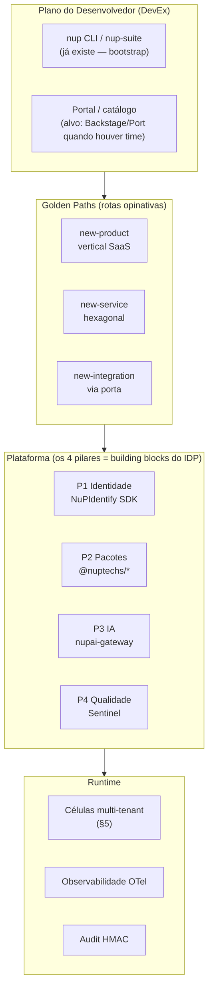
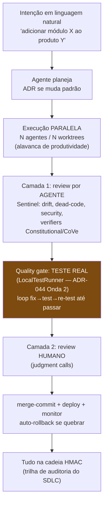
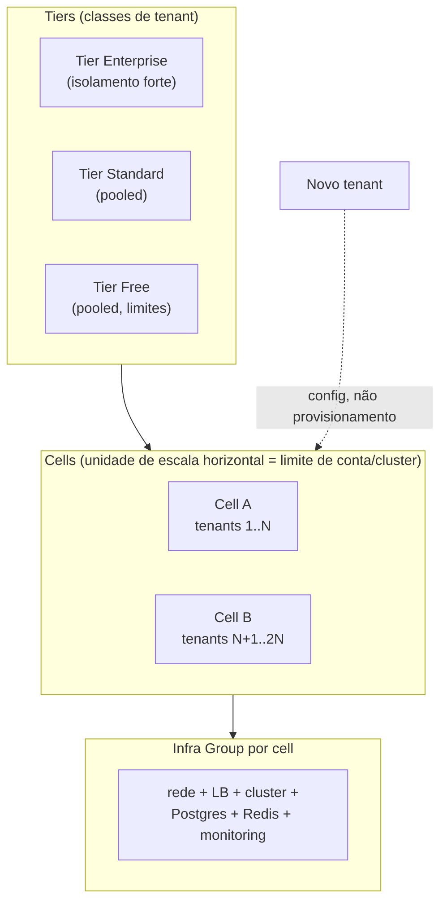

# Target Architecture at Scale — A Fábrica de Software NuPTechs

> **TOGAF — Target Architecture (visão de escala) + ADM adaptado para IA.** Projeção *to-be* da NuPTechs como uma **fábrica de software AI-native**: um Internal Developer Platform (IDP) com *golden paths*, um SDLC agentic governado, e multi-tenancy celular em escala. Não é fantasia — parte do que **já existe** (os 4 pilares + Sentinel + a prática de N sessões Claude em paralelo) e nomeia/formaliza/projeta o resto, ancorado no melhor da tecnologia 2026.

**Base de pesquisa:** platform engineering / golden paths (Gartner: 80% das grandes orgs com time de plataforma em 2026), agentic SDLC ("Goal-In, Outcome-Out"; 2026 = ano da qualidade de IA), arquitetura celular multi-tenant. Ver [benchmark §6](../benchmark/ea-benchmark-world-class.md).

---

## 1. A tese de escala em uma frase

> **A NuPTechs não é uma empresa que faz software — é uma empresa que faz *fábricas* de software: uma plataforma (os 4 pilares) + uma linha de montagem AI-native (Sentinel + golden paths) que transforma uma ideia de produto vertical em um SaaS multi-tenant, conforme e monetizável, em dias.**

Hoje isso é feito **artesanalmente** (um founder + sessões Claude paralelas, worktree→PR→deploy→self-heal). A projeção de escala é **industrializar** esse artesanato sem perder a governança.

---

## 2. O que já temos vs o que a escala exige

| Capacidade de fábrica | Hoje (artesanal, real) | Alvo (industrial) |
|---|---|---|
| **Plataforma compartilhada** | 4 pilares existem (identidade/pacotes/IA/qualidade) | IDP composable com golden paths |
| **Linha de montagem** | worktree→PR→merge→deploy→monitor (manual, disciplinado) | Golden path automatizado idea→prod |
| **Governança de qualidade** | Sentinel (detecta, corrige, abre PR) + ADR + HMAC | Sentinel como *quality gate* obrigatório no golden path; loop self-healing fechado |
| **SDLC com IA** | N sessões Claude em paralelo (já é agentic!) | Agentic SDLC governado, review 2-camadas, paralelismo orquestrado |
| **Multi-tenancy** | app-layer por produto; RLS dormente | Arquitetura celular (tier×cell), tenant = config |
| **Onboarding de produto** | copiar padrões, registrar no IdP, deploy | `nup new-product` → produto vivo com pilares plugados |

> **Insight:** a NuPTechs já opera o *método* de uma fábrica AI-native que a indústria está só começando a descrever em 2026. O ativo é o **método já praticado**; a dívida é **plataformizá-lo**.

---

## 3. Camada 1 — Internal Developer Platform (IDP) com Golden Paths

Princípio 2026: **tratar a plataforma como produto, não infra**; IDP *composable* best-of-breed sem lock-in; *golden path* = rota suportada, documentada e assistida por ferramenta de idea→produção que embute as melhores práticas.

### Golden Path nº 1 — "Instanciar um produto vertical" (a linha de montagem)
O caminho que transforma uma ideia (ex: "gestão de clínicas") em produto vivo:

**Cada etapa já tem peça real:** `nup-suite` (scaffold/bootstrap), `register-*-client.ts` (IdP), `@nuptechs/*` (pacotes), `nupai-gateway` (IA), Sentinel (qualidade), padrão Railway/Docker (deploy). O golden path **costura o que existe** num fluxo único, opinativo e automatizado — eliminando os 5 padrões divergentes de hoje (auth, IA, deploy).

### Princípios do IDP (derivados da pesquisa)
1. **Plataforma é produto** — tem roadmap, versionamento e *clientes* (os produtos verticais e as sessões IA). Os ADRs de plataforma (nup-platform) já são isso.
2. **Composable, sem lock-in** — best-of-breed por porta hexagonal (já é a cultura). Trocar Railway→K8s, Anthropic→Bedrock = trocar adapter.
3. **Golden path opinativo, mas com escape** — o caminho fácil é o conforme; desvios são possíveis mas explícitos (ADR).
4. **Self-service** — `nup new-*` em vez de pedir ao founder.

---

## 4. Camada 2 — SDLC Agentic Governado (o ADM adaptado para IA)

A NuPTechs já faz **agentic SDLC** antes de a indústria nomear: o usuário roda N sessões Claude em paralelo, cada uma worktree→PR→deploy→self-heal. A projeção formaliza isso com a governança que 2026 chama de "ano da qualidade de IA".

### O que falta para fechar (e onde está)
- **Review em 2 camadas** (agente → humano): a Camada 1 (Sentinel + verifiers) **existe**; a Camada 2 (humano) é o PR review. ✅ já é o fluxo.
- **Quality gate com teste real**: **é o gap** — hoje o "verify" do Sentinel é auto-crítica de LLM, não execução de teste (ADR-044 Onda 2 incompleta, sem `LocalTestRunner`). **Fechar isto é o item nº 1 da fábrica** — transforma "auto-correção plausível" em "self-healing verificado".
- **Orquestração de paralelismo**: hoje é o humano abrindo N sessões. Alvo: orquestrador (estilo Sentinel ou workflow) que distribui tarefas independentes a N agentes e coleta — o que a pesquisa chama de "team-scale output from a single developer".
- **Governança unificada**: agentes operando sob política única (segurança, permissão, audit). O NuPIdentify (ABAC/ReBAC) + HMAC já são a base; falta plugar os agentes nela.

> **Esta é a maior alavanca competitiva da NuPTechs:** ninguém combina *fábrica AI-native + governança HMAC + on-prem + compliance de domínio*. É o pitch do ADR-044 — agora ancorado no estado-da-arte 2026 do agentic SDLC.

---

## 5. Camada 3 — Multi-tenancy Celular em Escala

Hoje cada produto faz multi-tenancy na camada de app (RLS dormente). Para escalar a *muitos clientes por produto* sem reescrever, o alvo é a **arquitetura celular** (padrão AWS SaaS / cell-based 2026).

### Modelo de isolamento (recomendado: shared compute + isolated data)
| Camada | Padrão-alvo | Onde a NuPTechs está |
|---|---|---|
| Compute | Pooled (compartilhado) por cell | já é (um deploy serve N tenants) |
| Dado | **Isolado por tenant via RLS** (defesa-em-profundidade) | 🔴 **RLS dormente — ativar é pré-requisito de escala** |
| Identidade | Tenant = `organization_id` no JWT | ✅ NuPIdentify |
| Custo/limite | Por tier (NuPIdentify licensing) | ✅ `system_license_tiers` já modela isso |

### Princípios de escala
1. **Novo tenant = mudança de config**, nunca provisionamento de infra (onboarding em minutos).
2. **Cell = unidade de blast-radius** — falha de uma cell não derruba o parque; também unidade de residência de dado (gov BR / soberania).
3. **RLS ativa é inegociável** para pooled — o gap R2 deixa de ser "dívida" e vira **bloqueador de escala**.
4. **Tiers mapeiam a monetização** — o licensing por sistema do NuPIdentify já é o motor; cells materializam os tiers.

---

## 6. NuPTechs Technical Reference Model (resumo)
A fundação técnica de building blocks está detalhada no [Technical Reference Model](technical-reference-model.md) (TRM adaptado) + III-RM (fluxo de informação sem fronteiras entre produtos via pilares + event bus). Em uma linha: **os 4 pilares são o TRM da NuPTechs; o event bus (outbox→Redis Streams) + o IdP são o III-RM**.

---

## 7. Projeção de escala — de artesanal a industrial

| Dimensão | Hoje | T+ (fábrica madura) |
|---|---|---|
| Produtos verticais | ~11 (maturidade desigual) | N, cada um nascido do golden path em dias |
| Quem opera a fábrica | Founder + sessões Claude ad-hoc | Founder + agentes orquestrados + (futuro) time pequeno |
| Time-to-new-product | Semanas (artesanal) | Dias (golden path) |
| Onboarding de tenant | Por produto, manual | Config (célula) |
| Qualidade | Sentinel parcial (sem loop fechado) | Quality gate com teste real obrigatório |
| Governança | ADR + HMAC + EVIDENCE-REGISTER | + Architecture Compliance Review recorrente + agentes sob política única |
| Lock-in | Baixo (hexagonal) | Zero por design (composable) |

### Sequência recomendada (sobre as ondas T0–T3)
A fábrica não é um projeto separado — é o que as [Transition Architectures](../phases/transition-architectures.md) *constroem*, relido pela lente de fábrica:
- **T1 (fundação segura)** entrega o pré-requisito de escala: **RLS ativa** (multi-tenancy celular viável) + identidade 100%.
- **T2 (IA unificada)** entrega o **building block de IA do IDP** (gateway deployado e adotado).
- **T3 (endurecimento)** entrega o **quality gate da fábrica** (Sentinel loop fechado — ADR-044 Onda 2) + deploy padrão (golden path de deploy) + observabilidade.
- **Pós-T3 — "Industrializar":** empacotar os golden paths no `nup-suite` (`nup new-product`), orquestrar paralelismo de agentes, materializar células.

---

## 8. Riscos específicos da escala

| Risco | Mitigação |
|---|---|
| Industrializar cedo demais (over-engineering) | Golden paths só depois de T1–T3; padronizar o que já se repete, não especular |
| RLS dormente bloqueia pooled multi-tenant | É pré-requisito de T1 (R2) — priorizar |
| Paralelismo de agentes sem governança = caos | Plugar agentes no NuPIdentify (ABAC) + HMAC antes de orquestrar em escala |
| Golden path vira camisa-de-força | Sempre com "escape hatch" via ADR (princípio 3) |
| Custo de IA explode com a fábrica | Gateway como ponto único de custo/observabilidade (P3) — exatamente o que resolve |

---

## 9. Síntese para o investidor

A NuPTechs tem o ativo mais raro de 2026: **um método de fábrica de software AI-native já em operação**, com governança (HMAC/audit), on-prem e compliance de domínio que as big techs não têm como pacote. A projeção aqui não inventa — **industrializa o que já funciona**: nomeia o IDP, formaliza os golden paths, fecha o loop de qualidade, e materializa a multi-tenancy celular. O resultado é uma empresa que **lança produtos verticais conformes em dias** sobre uma plataforma proprietária defensável. Esse é o salto de "coleção de apps" para "**fábrica de produtos**".
