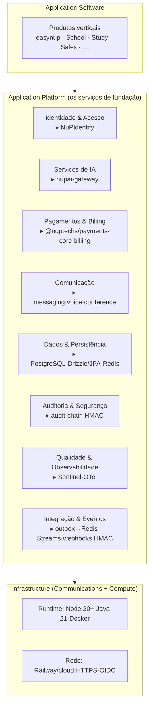

# NuPTechs Technical Reference Model (TRM) + III-RM

> **TOGAF Reference Models** adaptados à NuPTechs — os artefatos que faltavam para conformidade world-class (ver [benchmark](../benchmark/ea-benchmark-world-class.md)). O **TRM** descreve a fundação de *building blocks técnicos + standards* sobre a qual toda arquitetura específica se apoia. O **III-RM** descreve a infraestrutura de informação integrada que permite **Boundaryless Information Flow** (fluxo de informação sem fronteiras) entre os produtos.

---

## PARTE A — Technical Reference Model (TRM)

O TOGAF TRM tem dois eixos: uma **taxonomia** de serviços de plataforma e um **conjunto de standards** para cada um. Abaixo a realização concreta da NuPTechs — cada serviço da taxonomia tem seu **building block real** e o **standard adotado**.

### A.1 Taxonomia de serviços de plataforma (TRM NuPTechs)

### A.2 Building blocks × standards (a "tabela de verdade" técnica)

| Serviço de plataforma (TRM) | Building Block NuPTechs | Standard / protocolo adotado |
|---|---|---|
| **Identidade & Acesso** | NuPIdentify + SDK | OIDC/OAuth2 (auth_code, PKCE, device, client_credentials), SAML (SP), SCIM 2.0, RBAC+ABAC+ReBAC(Zanzibar), JWT, MFA TOTP, DPoP/PAR |
| **Serviços de IA** | nupai-gateway | OpenAI-compatible API, MCP, RAG (hybrid BM25+vetor+RRF), provider-agnostic via porta `LLMProviderPort` |
| **Pagamentos & Billing** | `@nuptechs/payments-core`, `billing`, `outbox-worker` | Multi-PSP (Stripe, MercadoPago), transactional outbox, idempotency keys, Stripe Connect (marketplace) |
| **Comunicação** | `messaging-*`, `voice-agent-*`, `conference` | WebSocket, ElevenLabs (voice), LiveKit/mediasoup (SFU), HLS |
| **Dados & Persistência** | PostgreSQL 16 + Drizzle (Node) / JPA-Hibernate-Liquibase (Java) + Redis | SQL, JSONB + JSON Schema 2020-12 (custom fields), pgvector, RLS (alvo) |
| **Auditoria & Segurança** | `@nuptechs/audit-chain` + AuditHashChainComponent | HMAC-SHA256 encadeado (CHAIN_VERSION 3), fail-closed, cross-process Java↔Node |
| **Qualidade & Observabilidade** | Suite Sentinel + OTel | OpenTelemetry, Prometheus, Grafana/Tempo, SARIF 2.1, Finding v2, MCP |
| **Integração & Eventos** | outbox→Redis Streams + webhooks | Redis Streams (XADD/XREADGROUP), pub/sub, webhook HMAC + anti-replay + idempotency |
| **Configurabilidade** | Schema-as-Code (easynup) + FEEL/DMN | JSON Schema 2020-12, DMN hit-policies, FEEL |
| **Build & Distribuição** | Turborepo + tsup + Changesets | ESM+CJS dual-build, SemVer, GitHub Packages |
| **Deploy** | Dockerfile + Railway (+ Helm) | OCI containers, healthcheck, migrations-on-startup, on-prem-capaz |

### A.3 Qualidades de serviço (TRM — atributos transversais)

| Qualidade | Como o TRM NuPTechs garante |
|---|---|
| **Portabilidade** | Dockerfile portável (NuPIdentify: Railway/AWS/GCP/Azure/Fly) |
| **Interoperabilidade** | Portas hexagonais; contratos `{success,data}|{success,error}` (ADR-033) |
| **Segurança** | OIDC + RBAC/ABAC/ReBAC + HMAC fail-closed + RLS (alvo) |
| **Escalabilidade** | Stateless + outbox + Redis Streams + multi-tenant celular (alvo) |
| **Auditabilidade** | Cadeia HMAC tamper-proof em todo evento sensível |
| **Manutenibilidade** | Hexagonal + reuso de pacotes + ADRs |

> **Leitura world-class:** este TRM diz que **os 4 pilares + nup-platform são a "Application Platform" da NuPTechs** — a fundação reusável sobre a qual qualquer produto vertical (Application Software) se apoia. É o que torna a fábrica de software possível.

---

## PARTE B — Integrated Information Infrastructure Reference Model (III-RM)

O III-RM responde à pergunta: *como a informação flui entre os produtos sem fronteiras (Boundaryless Information Flow)?* É sobre **integração de informação**, não só de tecnologia.

### B.1 O desafio de fluxo de informação na NuPTechs

```mermaid
graph LR
    subgraph PRODUCERS["Produtores de informação"]
        EZ[easynup<br/>contratos/decisões]
        SCH[School<br/>eventos escolares]
        SAL[Sales<br/>pedidos/pagamentos]
    end
    subgraph BACKBONE["Espinha dorsal de informação (III-RM)"]
        ID["Identidade canônica<br/>NuPIdentify<br/>(quem é quem, quem pode o quê)"]
        BUS["Event Backbone<br/>outbox→Redis Streams<br/>(o que aconteceu)"]
        AUD["Trilha canônica<br/>audit-chain HMAC<br/>(prova do que aconteceu)"]
        AI["Conhecimento<br/>nupai-gateway RAG<br/>(o que se sabe)"]
    end
    subgraph CONSUMERS["Consumidores"]
        BILL[Billing]
        NOTIF[Notificações]
        ANALYT[Analytics/Audit360]
        AGENT[Agentes de IA via MCP]
    end
    PRODUCERS --> BACKBONE --> CONSUMERS
```

### B.2 Os quatro "rios" de informação sem fronteiras

| Rio de informação | Building block | Garante |
|---|---|---|
| **Identidade** ("quem") | NuPIdentify (OIDC + ReBAC) | Toda informação carrega *quem* e *quem pode ver* — fonte única de identidade/permissão cruza todos os produtos |
| **Eventos** ("o que aconteceu") | outbox→Redis Streams (`nup.<domínio>.<evento>`) | Um evento de um produto (ex: `payment.succeeded`) é consumível por qualquer outro, de forma durável e idempotente |
| **Prova** ("o que de fato aconteceu") | audit-chain HMAC (CHAIN_VERSION 3, cross-process) | Trilha tamper-proof unificada — a *mesma* cadeia atravessa Java e Node |
| **Conhecimento** ("o que se sabe") | nupai-gateway RAG (namespaces por tenant) | Conhecimento de domínio (jurídico, etc.) acessível por IA, isolado por tenant |

### B.3 Princípios de Boundaryless Information Flow (NuPTechs)

1. **Identidade é o passaporte universal** — nenhuma informação trafega sem `organization_id` + sujeito (NuPIdentify). É o que torna o fluxo *seguro* sem fronteiras.
2. **Eventos são o transporte** — produtos publicam fatos no event backbone; consumidores reagem. Desacopla produtores de consumidores (o bridge Java↔Streams é o elo a fechar — hoje é design).
3. **A prova é única e tamper-proof** — uma cadeia HMAC, não N trilhas. Permite auditar fluxo cross-produto.
4. **O conhecimento é governado e isolado** — RAG por tenant; IA nunca cruza fronteiras de tenant (namespaces).

### B.4 Gap atual do III-RM (honesto)
- **Event backbone subutilizado cross-produto** — o outbox→Redis Streams existe em nup-platform (payments), mas o bridge HTTP para consumidores Java (easynup) é **design documentado, não wired** (ver EVIDENCE-REGISTER C13). Hoje o fluxo de informação entre produtos é mais *ponto-a-ponto* (OIDC, webhooks) que *backbone*.
- **Alvo:** promover o event backbone a espinha dorsal real — todo produto publica/consome fatos pelo mesmo barramento. É o que habilita a fábrica (um produto novo "se inscreve" no fluxo, não integra ponto-a-ponto).

---

## C — Como TRM e III-RM sustentam a fábrica

| Modelo | Papel na fábrica de software |
|---|---|
| **TRM** | Define os *building blocks* que o golden path pluga — "instanciar produto" = compor serviços do TRM |
| **III-RM** | Define como o novo produto *entra no fluxo de informação* sem integração ponto-a-ponto — "se inscreve" no event backbone, herda identidade e trilha de auditoria |

Juntos, são a **fundação reusável** que transforma "fazer um app do zero" em "compor um produto sobre a plataforma" — a essência da [Fábrica de Software](software-factory-target.md).

---

> **Conformidade world-class:** com TRM + III-RM, a EA da NuPTechs passa a incluir os dois reference models que o TOGAF Standard define e que um trabalho de equipe certificada sempre entrega. Ver o [scorecard de benchmark](../benchmark/ea-benchmark-world-class.md#2-scorecard-de-conformidade-architecture-compliance-review).
